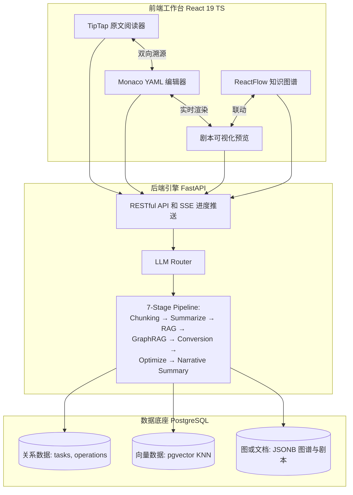

<p align="center">
  <h1 align="center">🎬 NovelScript (析幕)</h1>
  <p align="center">
    <strong>AI 驱动的长篇小说到结构化剧本转换系统</strong><br>
    <em>An AI-driven conversion system from long-form novels to structured scripts.</em>
  </p>
  <p align="center">
    
    
    
    
    
    
  </p>
</p>

## 📖 项目简介 (Overview)

**NovelScript (析幕)** 是一款面向网文 IP 影视化改编市场的企业级 AI 内容管线系统。

在传统的 IP 改编中，将数十万字的非结构化小说转化为符合视听语言逻辑的标准剧本，是一项极度耗时且依赖人工经验的工作。市面上的工具多局限于简单的格式排版，缺乏对故事因果结构、角色关系演进及场景调度的深度语义理解。

NovelScript 摒弃了“一个 Prompt 搞定一切”的玩具思维，构建了一条**高可用、带溯源、强校验的异步 AI 内容管线**。它能够将 3 章以上的长篇小说，精准转化为符合影视工业标准（兼容 Fountain 语法）的结构化剧本，并提供**原文双向追溯**、**知识图谱可视化**与 **AI 辅助协同编辑**功能，大幅降低 IP 改编门槛。

> 💡 **核心理念**：大模型的输出是概率性的，但工业管线必须是确定性的。我们用工程的严谨（强校验/All-in-One DB/并发削峰），锁定 AI 的创造力。

## ✨ 核心特性 (Core Features)

### 🚀 1. 工业级双模型路由与并发管线

- **智能路由**：严格区分 `DeepSeek-v4-pro`（负责高难度的核心场景转换与图谱抽取）与 `DeepSeek-v4-flash`（负责轻量摘要、对话与补丁生成），在保证质量的同时极致压缩 Token 成本。
- **7 阶段智能管线**：Chunking → Summarize → RAG → GraphRAG → Conversion → Optimization → Narrative Summary。每阶段独立回退，段落级切分杜绝裸截断。

### 🛡️ 2. 应用层重试与 Pydantic V2 强校验

- 彻底解决 LLM 结构化输出（JSON）的"格式漂移"痛点。
- 独创 **指数退避重试**：每阶段可配置 (1-3 次)，处理网络错误、超时、限流、5xx。不可重试的 4xx 直接上抛。
- `JsonOutputParser` + `model_validate()` 双阶段校验，各级独立回退——系统绝不崩溃。

### 🔗 3. 双向溯源映射 (Trace Mapping)

- 剧本中的每一个元素（对白/动作）均强制注入 `source_ref` 锚点（包含 `chapter_id` 与 `offset`）。
- 在前端 Web IDE 中，点击任意剧本台词，左侧原文阅读器自动平滑滚动至对应段落并高亮，确保 AI 改编的**绝对可审计性**。

### 🗄️ 4. All-in-One PostgreSQL 极简架构

- **拒绝组件堆砌**：摒弃了传统的 `MySQL + FAISS + Neo4j` 臃肿架构。
- 利用 **PostgreSQL 18+** 作为唯一数据底座：
    - 使用 `pgvector` 插件替代独立向量数据库，在库内直接完成 HNSW 索引与 KNN 检索，构建长文本 RAG 记忆网络。
    - 使用 `JSONB` 与 `JSONPath` 替代图数据库，轻量级存储与查询角色关系知识图谱。
    - 保证了事务的 ACID 特性，让 72 小时内的 Docker 编排与运维心智负担降至最低。

### 🎬 5. 无缝对接影视工业 (Fountain 战略支点)

- 除了输出供系统读取的 YAML/JSON，更支持一键导出 **Fountain** 纯文本标记格式。
- 打破 AI 工具与传统影视工业的壁垒，生成的 `.fountain` 文件可直接导入 Final Draft、Celtx 等专业编剧软件，具备直接投入商业生产的价值。

## 🏗️ 系统架构 (Architecture)

系统采用**前后端分离 + All-in-One 数据底座**的极简微服务架构。



## 🛠️ 技术栈 (Tech Stack)

| 领域        | 技术选型                                                                   | 说明                                 |
| :---------- | :------------------------------------------------------------------------- | :----------------------------------- |
| **前端**    | React 19, TypeScript, Vite, Ant Design 6, TipTap, Monaco Editor, ReactFlow | 构建 Web IDE 级别的三栏协同编辑体验  |
| **后端**    | Python 3.13, FastAPI (sync psycopg2), Pydantic V2, Uvicorn                 | 同步数据层 + 异步管道引擎并行        |
| **AI 编排** | LangChain, DeepSeek API (v4-pro / v4-flash)                                | 多阶段 Pipeline 编排与智能模型路由   |
| **数据库**  | PostgreSQL 18 (`pgvector`, `uuid-ossp`)                                    | 关系型 + 向量检索 + JSONB 多模态融合 |
| **部署**    | Docker, Docker Compose, Nginx                                              | 一键容器化编排，环境强一致性         |

## 🚀 快速开始 (Quick Start)

只需 3 步，即可在本地拉起完整的 NovelScript 服务。

### 1. 环境准备

确保你的机器已安装 [Docker](https://www.docker.com/) 和 [Docker Compose](https://docs.docker.com/compose/)。

### 2. 配置环境变量

克隆仓库并配置你的大模型 API Key：

```bash
git clone https://github.com/your-username/NovelScript.git
cd NovelScript
cp .env.example .env
# 编辑 .env 文件，填入你的 DEEPSEEK_API_KEY
```

### 3. 一键启动

```bash
docker-compose up -d --build
```

- **前端工作台**：访问 [http://localhost:5173](http://localhost:5173)
- **后端 API 文档**：访问 [http://localhost:8000/docs](http://localhost:8000/docs) (Swagger UI)

## 📂 项目结构 (Project Structure)

```text
NovelScript/
├── docker-compose.yml          # 编排 Frontend, Backend, PostgreSQL
├── .env.example                # 环境变量模板
│
├── backend/                    # 🐍 FastAPI 后端核心
│   ├── app/
│   │   ├── api/                # RESTful 路由与 SSE 推送
│   │   ├── core/               # 配置、安全与 DB 连接 (asyncpg)
│   │   ├── models/             # Pydantic V2 数据模型与 YAML Schema
│   │   ├── services/           # 核心业务：LLM 路由、RAG 检索、Auto-Fix
│   │   └── db/                 # PostgreSQL DDL 与初始化脚本
│   ├── Dockerfile
│   └── pyproject.toml
│
├── frontend/                   # ⚛️ React 前端工作台
│   ├── src/
│   │   ├── components/         # Monaco 编辑器、TipTap、溯源高亮逻辑
│   │   ├── views/              # 三栏布局主视图
│   │   └── stores/             # Zustand 状态管理
│   ├── Dockerfile
│   └── package.json
│
└── docs/                       # 📄 架构白皮书与路演材料
    ├── SRS 需求规格说明书.md     # 软件需求规格说明书 (含 YAML Schema 设计原理)
    └── dev_references.md        # 开发参考文档索引
```

## 🗺️ 演进路线 (Roadmap)

- [x] **Phase 1: 核心管线与 All-in-One 架构 (Current)**
    - 跑通小说到 YAML/Fountain 的转换闭环。
    - 实现 pgvector RAG 记忆网络与 Pydantic Auto-Fix。
- [ ] **Phase 2: 多模态扩展 (Next)**
    - 接入 TTS API，根据剧本情绪提示（Parenthetical）自动生成角色配音。
    - 接入文生图模型，根据 Scene Action 生成场景概念气氛图。
- [ ] **Phase 3: SaaS 化与协同**
    - 引入 WebSocket 实现多人实时协同编辑剧本。
    - 构建针对“剧本戏剧张力”的自动化 LLM 评估基准（Evaluation Framework）。

## 📄 许可证 (License)

本项目基于 [GPL v3 License](LICENSE) 开源。

---

<p align="center">
  <strong>Built with ❤️ and ☕ by Dinosaur_MC for Qiniu XEngineer 2026.</strong>
</p>
