# NovelScript (析幕) 软件设计说明书

- **项目名称**：NovelScript (析幕) – AI 驱动的长篇小说到结构化剧本转换系统
- **文档版本**：v1.0.0
- **日期**：2026-06-05
- **作者**：Dinosaur_MC
- **关联文档**：[SRS 需求规格说明书](./SRS%20需求规格说明书.md) · [YAML Schema 设计说明](./YAML_Schema_设计说明.md)

---

## 1. 设计概述

### 1.1 设计目标

本系统旨在将数十万字非结构化小说文本自动转换为符合影视工业标准的结构化剧本（YAML/JSON/Fountain）。核心设计目标：

| 目标                | 约束条件                                                                                 |
| :------------------ | :--------------------------------------------------------------------------------------- |
| **确定性管线**      | 管道输出 100% 通过 Pydantic V2 严格校验，LLM 输出非法时自动修复（最大 2 次重试）         |
| **双向溯源**        | 每个剧本元素携带 `source_ref`（`chapter_id` + `offset`），实现原文↔剧本毫秒级联动        |
| **All-in-One 存储** | 以 PostgreSQL 18 作为唯一数据底座，集成 pgvector 向量检索 + JSONB 文档存储               |
| **成本可控**        | 严格区分 DeepSeek-v4-pro（知识图谱/一致性检查）与 DeepSeek-v4-flash（场景生成/对话）路由 |
| **单人可交付**      | 72 小时极限开发，架构简化为 Postgres → FastAPI → React 三层                              |

### 1.2 设计原则

| 原则               | 说明                                                                                                                           |
| :----------------- | :----------------------------------------------------------------------------------------------------------------------------- |
| **严格校验**       | 所有 LLM 输出在进入系统前必须通过 Pydantic V2 模型校验，不通过则触发 Auto-Fix 循环                                             |
| **溯源锚定**       | `source_ref` 下沉至每个 Scene 与 Element，基于字符偏移量 (Offset) 的双向高亮联动                                               |
| **结构化兜底**     | 每个结构化字段同时保留原始文本与拆解子字段，解析失败时降级回退到原始文本                                                       |
| **逻辑与物理解耦** | YAML 使用"逻辑块 (Logical Block)"聚合（如将角色、括号提示、对白聚合为 `dialogue_block`），导出引擎负责拆解为 Fountain "物理行" |
| **版本控制友好**   | YAML 文本格式天然适配 Git diff/merge，支持异步协作与全历史溯源                                                                 |

### 1.3 技术栈确认

| 层       | 技术选型                                                                                               |
| :------- | :----------------------------------------------------------------------------------------------------- |
| **前端** | React 19 + TypeScript + Vite, React Router v7, Zustand, Ant Design 6, Monaco Editor, TipTap, ReactFlow |
| **后端** | Python 3.13, FastAPI (async), Uvicorn, SQLModel + asyncpg, LangChain, sse-starlette                    |
| **数据** | PostgreSQL 18 + pgvector + uuid-ossp                                                                   |
| **AI**   | DeepSeek-v4-pro (知识图谱/一致性检查), DeepSeek-v4-flash (场景生成/对话/补丁)                          |
| **部署** | Docker Compose (Frontend + Backend + PostgreSQL), Nginx 反向代理                                       |

## 2. 系统架构设计

### 2.1 总体架构

系统摒弃传统的 "MySQL + FAISS + Neo4j" 多组件堆砌，采用 **PostgreSQL All-in-One** 架构：pgvector 替代 FAISS 做向量检索，JSONB 替代 Neo4j 做图数据存储，关系表管理任务与操作日志。

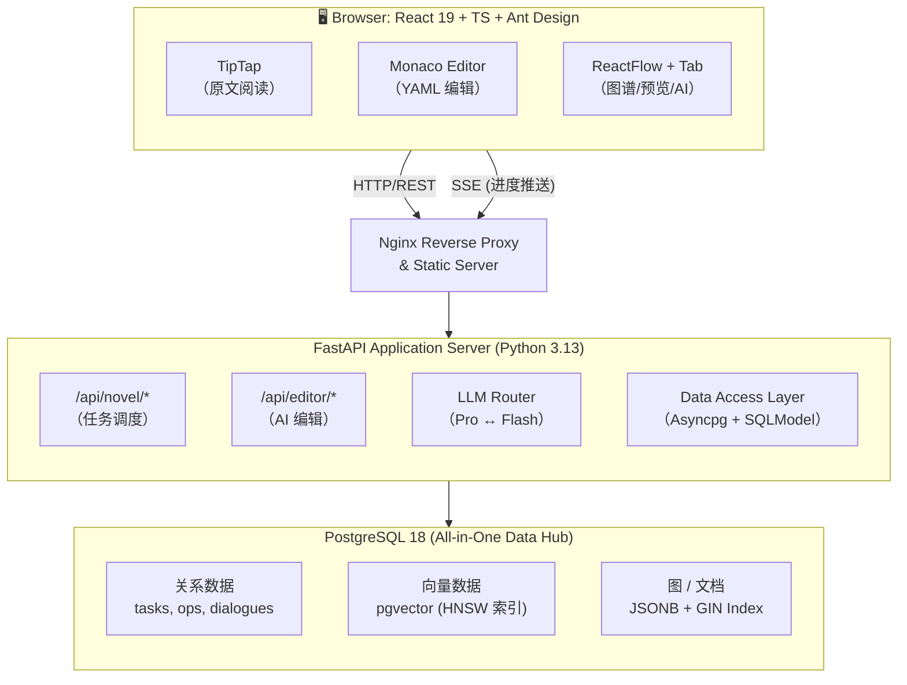

### 2.2 前端架构

```
frontend/app/
├── root.tsx                # 根布局 (Inter 字体, ErrorBoundary)
├── routes.ts               # 路由配置
├── routes/
│   └── home.tsx            # 主工作台页面 (三栏布局容器)
├── components/
│   ├── novel-reader/       # TipTap 原文阅读器 (左栏)
│   ├── script-editor/      # Monaco YAML 编辑器 (中栏)
│   ├── script-preview/     # 剧本可视化预览 (右栏 Tab1)
│   ├── knowledge-graph/    # ReactFlow 知识图谱 (右栏 Tab2)
│   ├── ai-chat/            # AI 对话面板 (右栏 Tab3)
│   ├── task-bar/           # 顶栏：Logo + 任务状态 + 导出菜单
│   └── status-bar/         # 底栏：进度条 + 系统日志
├── stores/                 # Zustand stores
│   ├── task-store.ts       # 任务状态 (status, progress, error)
│   ├── script-store.ts     # 剧本数据 (YAML/Fountain, source_refs)
│   ├── editor-store.ts     # 编辑器状态 (光标、选区、Undo/Redo)
│   └── ui-store.ts         # UI 状态 (面板宽度、Tab 切换)
├── hooks/                  # 自定义 hooks (SSE 订阅, 溯源跳转)
└── app.css                 # Tailwind CSS v4 + Inter 字体
```

- **状态管理 (Zustand)**：4 个独立 store，按领域拆分。跨 store 通信通过组件层调用多个 store action 实现。
- **SSE 进度推送**：使用 `EventSource` 订阅 `/api/novel/status/{task_id}` 的 SSE 流，实时更新 `task-store` 中的 `progress`。

### 2.3 后端架构

```
backend/app/
├── main.py                  # FastAPI 应用工厂, CORS, 异常处理器
├── core/
│   ├── config.py            # 环境变量加载 (API Key, DB URL, 模型参数)
│   ├── security.py          # API Key 隔离 (仅存后端, 前端不可见)
│   └── db.py                # PostgreSQL 连接池 (asyncpg)
├── api/
│   ├── __init__.py           # 路由聚合
│   ├── v1.py                 # v1 路由注册
│   ├── novel.py              # /api/novel/* (上传/预处理/转换/导出/状态)
│   └── editor.py             # /api/editor/* (对话/Patch/Undo)
├── models/
│   ├── http.py               # BaseResponse, ErrorResponse
│   ├── task.py               # TaskStatus, TaskResponse (Pydantic V2)
│   ├── script.py             # YAML Schema 完整 Pydantic 模型
│   └── patch.py              # JSON Patch RFC 6902 模型
├── services/
│   ├── llm_router.py         # DeepSeek Pro/Flash 模型路由
│   ├── pipeline.py           # 三阶段管道编排 (规划→生成→优化)
│   ├── preprocessor.py       # 章节切分 + 全局摘要/图谱提取
│   ├── converter.py          # 剧本转换引擎 (并发分片 + 溯源注入)
│   ├── validator.py          # Pydantic 强校验 + Auto-Fix 重试
│   ├── rag.py                # pgvector 向量化入库与相似度检索
│   ├── patcher.py            # JSON Patch 生成、验证、应用
│   ├── exporter.py           # YAML/JSON/Fountain 多格式导出
│   └── sse.py                # SSE 进度事件推送
└── db/
    ├── init.sql               # 完整 DDL
    └── migrations/            # 增量迁移脚本 (预留)
```

**分层职责**：

- **api/** — 薄路由层，仅做参数解析与 Response 封装，业务逻辑委托给 services
- **services/** — 核心业务逻辑，每个模块独立且可单独测试
- **models/** — Pydantic V2 数据模型，是 LLM 输出的强制校验门
- **core/** — 配置、安全、DB 连接等基础设施

## 3. 核心管道设计 (Pipeline)

### 3.1 三阶段管道总览

借鉴现代 AI Agent Pipeline 最佳实践，将小说→剧本转换分解为三个专业化阶段：

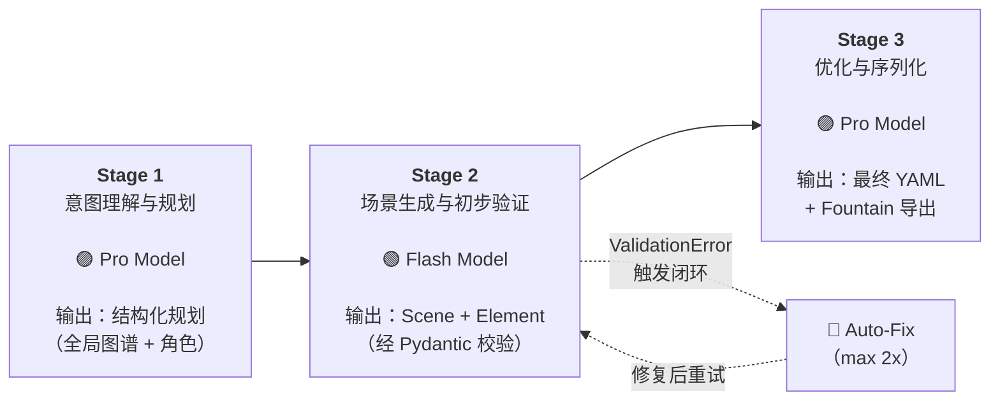

### 3.2 Stage 1: 意图理解与规划

- **模型**：DeepSeek-v4-pro（强推理能力, 1.6T 总参数/49B 激活参数）
- **输入**：完整小说章节文本
- **输出**：
    - 故事全局摘要 (`summary`)
    - 角色列表（含性格/身份/关系）
    - 地点列表
    - 角色关系网（图结构, JSONB）
- **处理流程**：
    1. 调用 Pro 模型做全局语义理解
    2. 提取角色实体、地点实体、关系三元组
    3. 构建 JSONB 知识图谱 (`nodes` + `edges`)
    4. 将章节文本 Embedding 化写入 pgvector（为 Stage 2 提供 RAG 检索）

> 对复杂请求，可启用 Pro 的 Thinking Mode (Chain-of-Thought)，让模型先输出思考过程再给出规划，提升输出质量。

### 3.3 Stage 2: 场景生成与初步验证

- **模型**：DeepSeek-v4-flash（高吞吐、低延迟、低成本, 284B/13B 激活参数）
- **输入**：Stage 1 的规划 + RAG 检索的前文记忆（通过 pgvector KNN 查询）
- **输出**：Scene 序列，每个 Scene 包含 Element 列表（action/dialogue/shot 等）
- **处理流程**：
    1. 以章节为单位，RAG 检索前文相关上下文注入 Prompt
    2. 调用 Flash 模型生成 Scene + Element 结构
    3. **Pydantic V2 严格校验**：输出必须通过 YAML Schema 对应的 Pydantic 模型
    4. 若校验失败 → 进入 Auto-Fix 闭环
    5. 校验通过后强制注入 `source_ref`（`chapter_id` + `offset`）

**并发控制**：

- 使用 `asyncio.Semaphore` 限制并发 Flash 调用数（默认 5）
- 单章超过 8000 字自动滑动窗口分片（chunk_size=4000, overlap=200）
- 通过 SSE 向前端推送实时进度

### 3.4 Stage 3: 优化与序列化

- **模型**：DeepSeek-v4-pro（宏观审视与创造性修改能力）
- **输入**：Stage 2 输出的已校验 Scene 集合
- **输出**：
    - 优化后的完整 YAML（结构性调整、对白润色、节奏优化）
    - Fountain 序列化文件
- **处理流程**：
    1. Pro 模型对全量 Scene 做一致性检查（角色性格、地点连续性、时间线合理性）
    2. 生成 Metadata（转换时间、使用模型、原著信息）
    3. 调用 Fountain 导出器序列化为 `.fountain` 文件
    4. 落库保存

### 3.5 闭环反馈与自动修复 (Auto-Fix Loop)

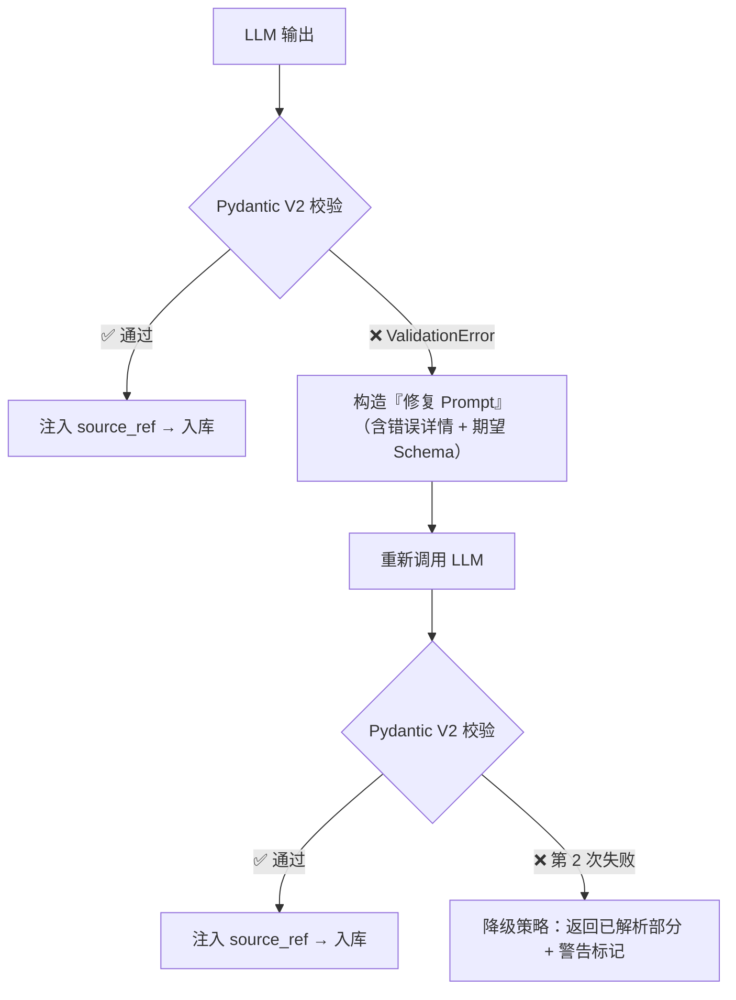

- **最大重试**：2 次
- **修复 Prompt**：包含原始输出的错误位置、Pydantic 错误详情、期望的正确 JSON Schema
- **降级兜底**：2 次重试均失败后，降级返回已成功解析的场景部分并标记警告，系统绝不崩溃

## 4. 模型路由策略

### 4.1 Pro / Flash 分工逻辑

| 任务类型                | 推荐模型          | 设计依据                                           |
| :---------------------- | :---------------- | :------------------------------------------------- |
| 全局知识图谱抽取        | DeepSeek-v4-pro   | 需要深度理解全文、实体关系抽取，要求最强推理能力   |
| 场景转换与重构          | DeepSeek-v4-flash | 模式化生成任务，Flash 成本效益高，速度满足迭代需求 |
| 全量 Scene 一致性检查   | DeepSeek-v4-pro   | 需要全局视野审视所有场景，发现潜在矛盾与 OOC       |
| 章节切分（兜底）        | DeepSeek-v4-flash | 轻量语义任务，当正则可覆盖 90% 时仅作补充          |
| AI 对话 / 上下文问答    | DeepSeek-v4-flash | 对延迟要求高，Flash 高速推理提供流畅对话体验       |
| Patch 生成 (结构化修改) | DeepSeek-v4-flash | 符合 RFC 6902 的模式化输出，Flash 足以胜任         |
| 对话摘要 / 轻量摘要     | DeepSeek-v4-flash | 低复杂度文本总结，Pro 浪费算力与成本               |

### 4.2 路由实现

```python
# 静态路由表（核心逻辑示意）
MODEL_ROUTING = {
    "global_extraction": DeepSeekV4Pro(),
    "scene_conversion": DeepSeekV4Flash(),
    "consistency_check": DeepSeekV4Pro(),
    "chapter_split": DeepSeekV4Flash(),
    "ai_chat": DeepSeekV4Flash(),
    "patch_generate": DeepSeekV4Flash(),
    "summarize": DeepSeekV4Flash(),
}
```

### 4.3 成本控制与降级策略

- **Pro 模型调用**：仅用于知识图谱抽取（Stage 1）与全量一致性检查（Stage 3），单次完整转换预估 20K tokens（约 ¥0.08）
- **Flash 模型调用**：承担 Stage 2 主要负载，单次对话约 2K tokens（成本极低）
- **预算约束**：¥1400 预算可支撑约 10,000 次完整转换
- **Redis 缓存（P2）**：对相同或高度相似的章节摘要进行缓存，避免重复消耗 Pro 模型 Token
- **降级**：若 Pro 模型不可用，Flash 可降级执行 Stage 1（质量下降但系统可用）

## 5. 数据模型设计

### 5.1 YAML Schema 四层架构

详见 [YAML Schema 设计说明](./YAML_Schema_设计说明.md)，核心分层：

| 层级                       | 职责                                                             |
| :------------------------- | :--------------------------------------------------------------- |
| **Layer 0: Fountain 同构** | 100% Fountain 1.1 往返保真（8 种元素类型, Title Page, Boneyard） |
| **Layer 1: 结构增强**      | 分解 heading 字段, `dialogue_block` 聚合, `source_ref` 3D 溯源   |
| **Layer 2: 叙事扩展**      | 闪回/闪前标记、多时间线 ID、画外音子类型、意识流标记等           |
| **Layer 3: 渲染与交付**    | Fountain 导出 + 直接 PDF 渲染                                    |

**完整 YAML Schema 示例**（见 SRS §6.1），顶层结构：

```text
script
├── meta          # 标题、作者、模型、时间戳、版本
├── summary       # 全局梗概
├── characters[]  # 角色列表 (id, name, description)
├── scenes[]      # 场景序列
│   ├── scene_id
│   ├── heading            # 场标 (内景/外景 . 地点 - 时间)
│   ├── location / time_of_day  # 拆解子字段
│   ├── characters_present[]    # 出场角色
│   └── elements[]             # 剧本元素 (action/dialogue/shot...)
│       ├── type
│       ├── content / line
│       └── source_ref           # { chapter_id, offset }
└── knowledge_graph
    ├── nodes[]       # 实体节点 (角色、地点、关键物品)
    └── edges[]       # 关系边 (relation, weight)
```

### 5.2 YAML 快照 + JSON Patch 混合存储模型

单一存储机制无法同时满足：低延迟实时编辑、可靠长期状态管理、精确历史追踪。本系统采用**混合模型**：

| 存储机制       | 记录内容                    | 优势                                     | 劣势                                   | 适用场景                  |
| :------------- | :-------------------------- | :--------------------------------------- | :------------------------------------- | :------------------------ |
| **YAML 快照**  | 应用在某时间点的完整状态    | 恢复状态简单高效；保证完整性；易实现重做 | 存储空间消耗大                         | 手动/自动保存点；阶段结束 |
| **JSON Patch** | 状态的增量式变更 (RFC 6902) | 存储效率极高；天然支持撤销；适合高频编辑 | 恢复早期状态计算开销大；依赖序列完整性 | 实时编辑；AI 补丁应用     |

**协同逻辑**：

1. 阶段完成 / 手动保存时 → 生成 YAML 快照存入 `operations.previous_snapshot`
2. 每次细粒度编辑（用户输入 / AI Patch）→ 记录 JSON Patch 存入 `operations.diff_json`
3. 撤销时 → 优先使用 JSON Patch 逆向操作（即时响应）；回溯超过 5 步或跨快照时 → 加载最近快照 + 重放区间 Patch

### 5.3 撤销/重做历史栈

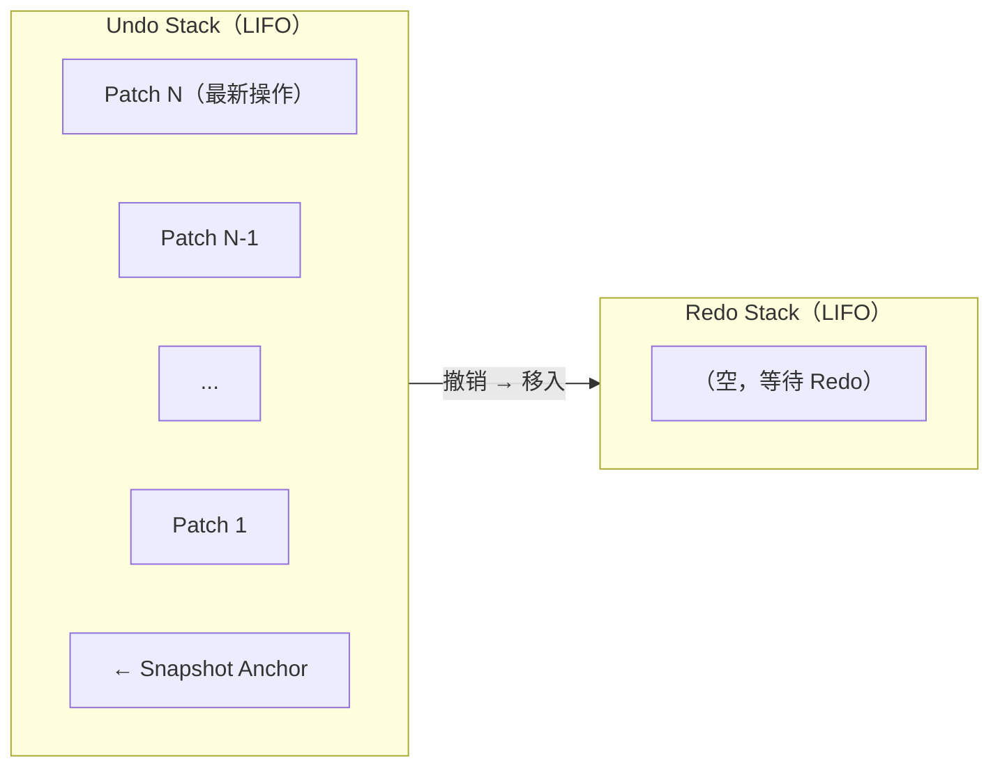

- **Undo**：从 Undo Stack 弹出最近 Patch，计算逆向 Patch 并应用 → 将该 Patch 移入 Redo Stack
- **Redo**：从 Redo Stack 弹出 Patch，正向应用 → 移回 Undo Stack
- **快照锚点**：加载新快照时清空 Redo Stack（因为"未来"已不再有意义）
- **容量限制**：最多保留 5 步连续 Undo/Redo，超出时自动创建新快照并裁剪旧 Patch 序列

### 5.4 双向溯源 (source_ref) 机制

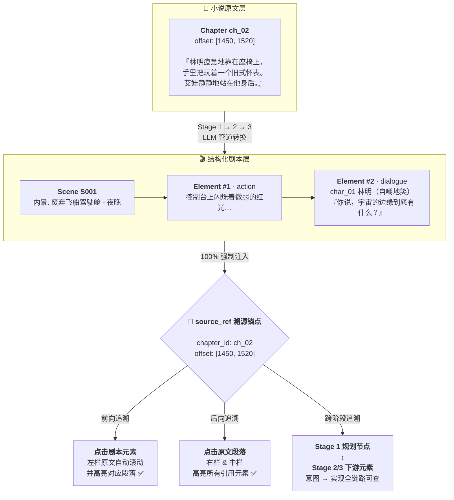

- **前向追溯**：点击剧本元素 → 原文段落自动滚动并高亮
- **后向追溯**：点击原文段落 → 所有引用该段落的剧本元素高亮
- **跨阶段追溯**：通过 Stage 1 规划节点 → 查看所有由此规划衍生的 Stage 2/3 产出物
- **实现**：前端通过 `source_ref.offset` 定位 TipTap 文档位置；后端通过 `chapter_id + offset` 查询反向引用

### 5.5 持久化存储 DDL

利用 pgvector 和 JSONB 实现 All-in-One 架构：

```sql
-- 启用必要插件
CREATE EXTENSION IF NOT EXISTS vector;
CREATE EXTENSION IF NOT EXISTS "uuid-ossp";

-- 1. 任务主表
CREATE TABLE tasks (
    id UUID PRIMARY KEY DEFAULT uuid_generate_v4(),
    source_text TEXT NOT NULL,
    status VARCHAR(50) NOT NULL DEFAULT 'pending',
    progress INT DEFAULT 0,
    summary TEXT,
    characters_json JSONB,
    knowledge_graph JSONB,
    script_yaml TEXT,
    script_json JSONB,
    script_fountain TEXT,
    error_message TEXT,
    created_at TIMESTAMPTZ DEFAULT NOW(),
    updated_at TIMESTAMPTZ DEFAULT NOW()
);
CREATE INDEX idx_tasks_status ON tasks(status);

-- 2. 章节与向量块表 (替代 FAISS，支持 RAG 检索)
CREATE TABLE chapters (
    id UUID PRIMARY KEY DEFAULT uuid_generate_v4(),
    task_id UUID REFERENCES tasks(id) ON DELETE CASCADE,
    chapter_index INT NOT NULL,
    title VARCHAR(255),
    content TEXT NOT NULL,
    embedding vector(1536),               -- 文本向量表示
    metadata JSONB,
    created_at TIMESTAMPTZ DEFAULT NOW()
);
CREATE INDEX ON chapters USING hnsw (embedding vector_cosine_ops);  -- HNSW 加速 KNN
CREATE INDEX idx_chapters_task ON chapters(task_id, chapter_index);

-- 3. 操作日志表 (JSON Patch + YAML 快照混合)
CREATE TABLE operations (
    id UUID PRIMARY KEY DEFAULT uuid_generate_v4(),
    task_id UUID REFERENCES tasks(id) ON DELETE CASCADE,
    type VARCHAR(50) NOT NULL,            -- 'manual_edit', 'ai_patch', 'snapshot', 'rollback'
    target_path TEXT,                     -- JSON Pointer 路径，如 'scenes[0].elements[1].line'
    diff_json JSONB,                      -- RFC 6902 JSON Patch
    previous_snapshot JSONB,              -- 修改前的完整快照 (仅在 type='snapshot' 时)
    applied BOOLEAN DEFAULT TRUE,
    created_at TIMESTAMPTZ DEFAULT NOW()
);
CREATE INDEX idx_ops_task_time ON operations(task_id, created_at DESC);

-- 4. AI 对话记录表
CREATE TABLE dialogues (
    id UUID PRIMARY KEY DEFAULT uuid_generate_v4(),
    task_id UUID REFERENCES tasks(id) ON DELETE CASCADE,
    role VARCHAR(20) NOT NULL,            -- 'user', 'assistant'
    content TEXT NOT NULL,
    patch_json JSONB,                     -- 若消息包含 Patch 则记录
    created_at TIMESTAMPTZ DEFAULT NOW()
);
CREATE INDEX idx_dialog_task_time ON dialogues(task_id, created_at);
```

**表关系概览**：

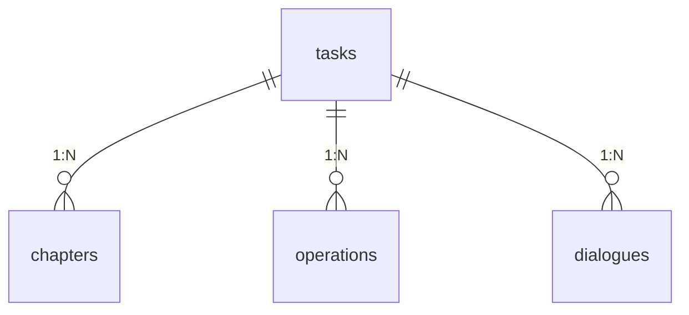

## 6. 任务状态机与生命周期

### 6.1 状态流转

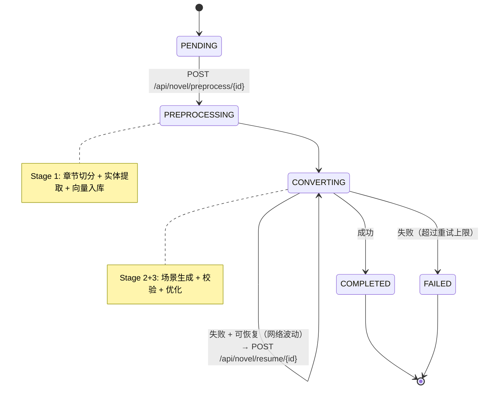

### 6.2 Pydantic 任务状态模型

```python
from pydantic import BaseModel, Field
from enum import Enum
from typing import Optional, List, Dict, Any
from datetime import datetime

class TaskStatus(str, Enum):
    PENDING = "pending"
    PREPROCESSING = "preprocessing"
    CONVERTING = "converting"
    COMPLETED = "completed"
    FAILED = "failed"

class TaskResponse(BaseModel):
    id: str
    status: TaskStatus
    progress: int = Field(ge=0, le=100)
    summary: Optional[str] = None
    characters: Optional[List[Dict[str, Any]]] = None
    script_yaml: Optional[str] = None
    script_fountain: Optional[str] = None
    error_message: Optional[str] = None
    created_at: datetime
```

### 6.3 SSE 进度推送

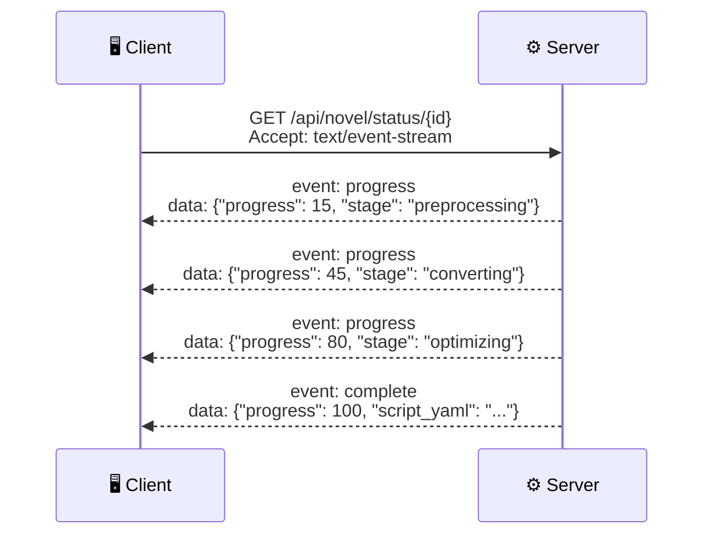

- **实现**：`sse-starlette` 库，后端通过 `asyncio.Queue` 收集 Pipeline 各阶段进度事件并推流
- **前端**：使用 `EventSource` API 订阅，实时更新 Zustand `task-store`

### 6.4 断点续传

- **触发条件**：转换过程中网络波动或 LLM 调用超时
- **恢复机制**：`POST /api/novel/resume/{task_id}` 读取 `chapters` 表中已成功转换的 `chapter_index`，从下一个未完成 Chunk 处继续，避免全盘重跑
- **幂等性**：已完成章节的 Scene 数据不被覆盖，仅追加新增部分

## 7. 模块详细设计

### 7.1 小说输入模块

- **输入方式**：
    - 文本粘贴：TipTap 编辑器内直接粘贴 Markdown/纯文本
    - 文件上传：`.txt` / `.md`，限制 5MB
    - URL 抓取 (P1)：`BeautifulSoup` 提取 `<article>` 或主内容区
- **章节切分**：
    1. 正则主切分：`第[零一二三四五六七八九十百千0-9]+章` 匹配中文章节标题
    2. LLM 语义兜底：正则无法匹配时调用 Flash 做语义分章
    3. 前端编辑器：展示切分结果列表，允许用户手动合并/拆分/调整顺序
- **数据流**：`输入 → 切分 → chapters 表写入 → 返回章节列表给前端确认`

### 7.2 RAG 记忆构建模块

- **向量化流程**：
    1. 章节文本通过 Embedding 模型（OpenAI text-embedding-3-small 或 bge-large-zh）转化为 1536 维向量
    2. 将向量 + 原文 + 元数据存入 `chapters` 表
    3. 创建 HNSW 索引 (`vector_cosine_ops`) 加速 KNN 检索
- **检索流程**（在 Stage 2 转换时触发）：
    1. 当前章节文本 → Embedding → `pgvector` KNN 查询
    2. 返回 top-K（默认 3）最相关的前文章节片段
    3. 作为 Context 注入 Stage 2 的 Prompt，防止角色 OOC

### 7.3 剧本转换引擎

- **Scene 切分与重构**：以章为单位，结合全局知识图谱 + RAG 检索的前文记忆，调用 Flash 模型将叙事文本转换为 Scene 序列
- **并发策略**：

    ```python
    # 核心并发模型
    semaphore = asyncio.Semaphore(5)  # 最大 5 并发

    async def convert_chapter(chapter, kg_context, rag_context):
        async with semaphore:
            if len(chapter.content) > 8000:
                return await sliding_window_convert(chapter, chunk_size=4000, overlap=200)
            return await single_convert(chapter, kg_context, rag_context)

    results = await asyncio.gather(*[convert_chapter(c, kg, rag) for c in chapters])
    ```

- **source_ref 注入**：校验通过后，为每个 Element 强制填充 `source_ref = {chapter_id, offset}`

### 7.4 AI 编辑与 Patch 模块

- **上下文感知对话**：
    1. 用户提问时，自动获取当前选中 Scene、相关角色设定、原文片段
    2. 组装为 System Prompt + 上下文 + 用户消息，调用 Flash 模型
- **Patch 生成**：
    - AI 回复中若包含结构化修改建议，同步生成符合 RFC 6902 的 JSON Patch
    - 格式：`{ "op": "replace", "path": "/scenes/1/location", "value": "图书馆" }`
    - Patch 在应用前经过 Schema 验证，确保修改后的 YAML 仍然合法
- **Undo/Redo**：见 §5.3

### 7.5 导出模块

- **YAML 导出**：直接从 `tasks.script_yaml` 读取并返回文件流
- **JSON 导出**：`tasks.script_json` 的 JSONB 字段直接序列化
- **Fountain 导出**：
    1. 遍历 Scene 序列
    2. Scene heading → `INT./EXT. 地点 - 时间`
    3. Action element → 纯文本段落
    4. Dialogue element → `角色名\n(括号提示)\n对白内容`
    5. 在文件头部注入 Title Page 元数据
    6. 一键下载 `.fountain` 文件

## 8. API 接口设计

### 8.1 RESTful 端点签名

#### 8.1.1 任务管理 (`/api/novel`)

| 方法   | 路径                              | 说明                                        |
| :----- | :-------------------------------- | :------------------------------------------ |
| `POST` | `/api/novel/upload`               | 上传小说文本 (multipart 或 JSON)            |
| `POST` | `/api/novel/preprocess/{task_id}` | 启动预处理 (章节切分 + 实体提取)            |
| `GET`  | `/api/novel/status/{task_id}`     | 查询任务状态 (支持 SSE 流式进度)            |
| `POST` | `/api/novel/convert/{task_id}`    | 启动剧本转换                                |
| `POST` | `/api/novel/resume/{task_id}`     | 断点续传                                    |
| `GET`  | `/api/novel/export/{task_id}`     | 导出剧本文件 (`?format=fountain/yaml/json`) |

**POST /api/novel/upload**

```json
// Request (JSON body)
{ "content": "第一章\n..." }
// 或 multipart/form-data (file)
```

```json
// Response 200
{
    "code": 0,
    "message": "上传成功",
    "data": {
        "task_id": "uuid",
        "chapters": [
            { "index": 1, "title": "第一章" },
            { "index": 2, "title": "第二章" }
        ]
    }
}
```

**GET /api/novel/status/{task_id}** (SSE)

```text
event: progress
data: {"progress": 30, "status": "converting", "stage": "scene_generation"}

event: progress
data: {"progress": 70, "status": "converting", "stage": "optimization"}

event: complete
data: {"progress": 100, "status": "completed", "script_yaml": "..."}
```

#### 8.1.2 AI 编辑 (`/api/editor`)

| 方法   | 路径                                | 说明                 |
| :----- | :---------------------------------- | :------------------- |
| `POST` | `/api/editor/chat/{task_id}`        | AI 对话 (上下文感知) |
| `POST` | `/api/editor/apply_patch/{task_id}` | 应用 AI 生成的 Patch |
| `POST` | `/api/editor/undo/{task_id}`        | 撤销最近操作         |

**POST /api/editor/chat/{task_id}**

```json
// Request
{ "message": "把第2场的地点改为图书馆", "scene_id": "S002" }
```

```json
// Response
{
    "code": 0,
    "data": {
        "reply": "好的，已生成修改建议。",
        "patch": {
            "op": "replace",
            "path": "/scenes/1/location",
            "value": "图书馆"
        }
    }
}
```

### 8.2 错误码规范

| 状态码 | 含义           | 示例场景                     |
| :----- | :------------- | :--------------------------- |
| 200    | 成功           | 正常返回                     |
| 400    | 客户端请求错误 | 上传内容为空、Patch 格式非法 |
| 404    | 资源不存在     | task_id 无效                 |
| 422    | 校验失败       | Pydantic 校验不通过          |
| 500    | 服务器内部错误 | LLM 调用失败、DB 连接异常    |
| 503    | 服务暂时不可用 | 模型 API 超时、系统过载      |

所有错误响应统一使用 `ErrorResponse` 模型：

```json
{
    "code": 422,
    "message": "脚本结构校验失败：scene_id 重复",
    "detail": "ValidationError: scenes[3].scene_id 'S001' already exists"
}
```

## 9. 前端架构设计

### 9.1 三栏布局模型

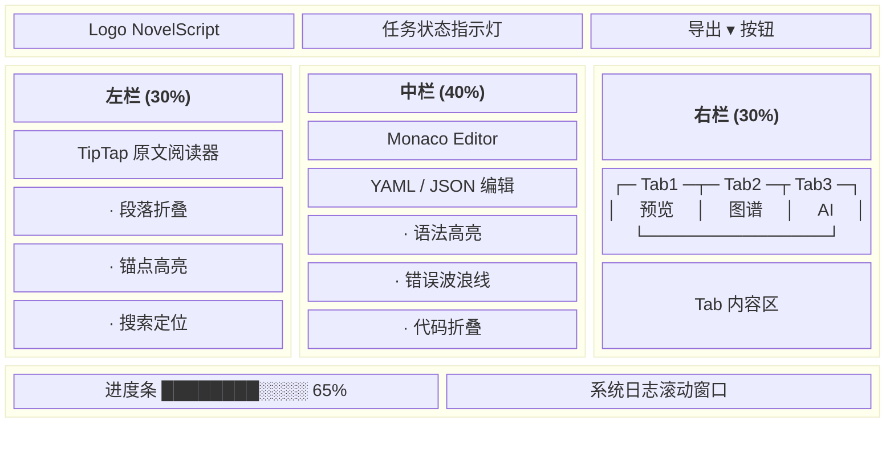

- **面板宽度可拖拽调整**
- **右栏 Tab 切换**：Tab1 剧本可视化排版、Tab2 ReactFlow 知识图谱、Tab3 AI 对话与 Patch 历史

### 9.2 状态管理 (Zustand)

```typescript
// task-store.ts — 任务状态
interface TaskStore {
    taskId: string | null;
    status: TaskStatus;
    progress: number; // 0-100
    errorMessage: string | null;
    setTaskId: (id: string) => void;
    updateProgress: (p: number, status: string) => void;
}

// script-store.ts — 剧本数据
interface ScriptStore {
    yaml: string | null;
    fountain: string | null;
    scenes: Scene[];
    characters: Character[];
    sourceRefs: Map<string, SourceRef>; // element_id → source_ref
    highlightElement: (id: string) => void;
    highlightSource: (chapterId: string, offset: [number, number]) => void;
}

// editor-store.ts — 编辑器状态
interface EditorStore {
    undoStack: JsonPatch[];
    redoStack: JsonPatch[];
    activeTab: "preview" | "graph" | "chat";
    applyPatch: (patch: JsonPatch) => void;
    undo: () => void;
    redo: () => void;
}

// ui-store.ts — UI 状态
interface UIStore {
    leftPanelWidth: number; // 百分比
    centerPanelWidth: number;
    rightPanelWidth: number;
    setPanelWidths: (l: number, c: number, r: number) => void;
}
```

### 9.3 组件树与数据流

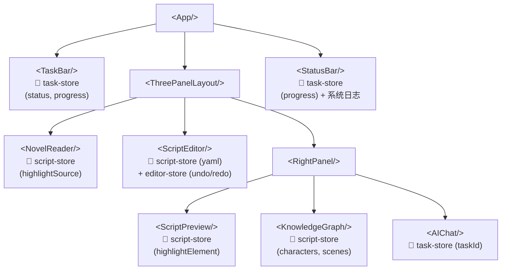

- **数据流**：单向 — 用户操作 → Zustand action → API 调用 → 更新 store → React 重渲染
- **SSE 订阅**：在 `NovelReader` 或 `TaskBar` 的 `useEffect` 中建立 `EventSource` 连接
- **溯源联动**：点击事件 → `script-store.highlightElement(id)` → 触发 `NovelReader` 滚动到对应 `offset`

### 9.4 双向溯源交互流程

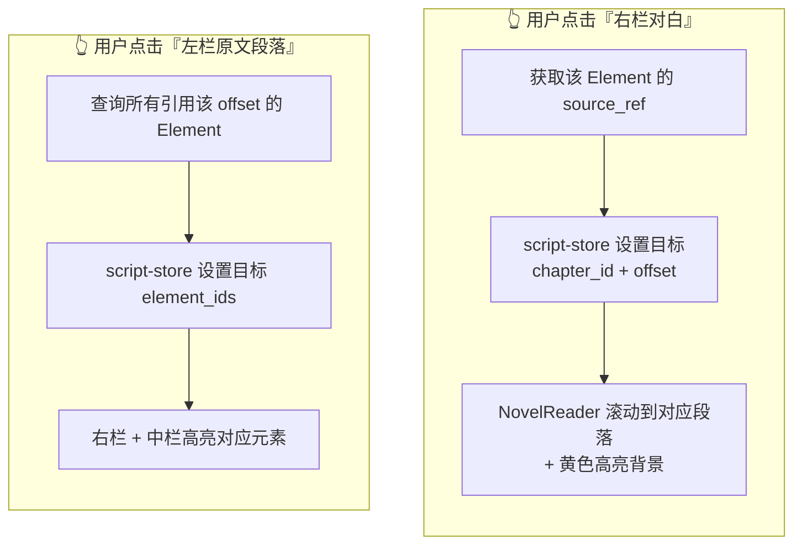

## 10. 部署设计

### 10.1 Docker Compose 编排

```yaml
# docker-compose.yml
version: "3.9"
services:
    db:
        image: pgvector/pgvector:pg18
        environment:
            POSTGRES_USER: novelscript
            POSTGRES_PASSWORD: ${DB_PASSWORD}
            POSTGRES_DB: novelscript
        volumes:
            - pgdata:/var/lib/postgresql/data
            - ./backend/app/db/init.sql:/docker-entrypoint-initdb.d/init.sql
        ports:
            - "5432:5432"

    backend:
        build: ./backend
        environment:
            DATABASE_URL: postgresql+asyncpg://novelscript:${DB_PASSWORD}@db:5432/novelscript
            DEEPSEEK_API_KEY: ${DEEPSEEK_API_KEY}
        depends_on:
            - db
        ports:
            - "8000:8000"

    frontend:
        build: ./frontend
        depends_on:
            - backend
        ports:
            - "5173:5173"

    nginx:
        image: nginx:alpine
        volumes:
            - ./nginx.conf:/etc/nginx/nginx.conf
        ports:
            - "80:80"
        depends_on:
            - backend
            - frontend

volumes:
    pgdata:
```

### 10.2 Nginx 反向代理

```nginx
server {
    listen 80;
    server_name novelscript.local;

    # 前端静态资源 + SSR
    location / {
        proxy_pass http://frontend:5173;
        proxy_set_header Host $host;
    }

    # 后端 API
    location /api/ {
        proxy_pass http://backend:8000;
        proxy_set_header Host $host;
        proxy_set_header X-Real-IP $remote_addr;
        # SSE 长连接
        proxy_buffering off;
        proxy_cache off;
        proxy_read_timeout 3600s;
    }

    # Swagger / ReDoc
    location /docs { proxy_pass http://backend:8000/docs; }
    location /redoc { proxy_pass http://backend:8000/redoc; }
    location /openapi.json { proxy_pass http://backend:8000/openapi.json; }
}
```

- **SSE 关键配置**：`proxy_buffering off; proxy_cache off;` 确保事件流不被 Nginx 缓冲

## 11. 测试设计

### 11.1 测试目标

验证长文本转换的连贯性、All-in-One 数据库的读写性能、AI 补丁应用的准确性及前端溯源交互的流畅度。

### 11.2 核心测试用例

| 编号      | 场景          | 操作步骤                                                  | 预期结果                                                                                  | 涉及模块                           |
| :-------- | :------------ | :-------------------------------------------------------- | :---------------------------------------------------------------------------------------- | :--------------------------------- |
| **TC-01** | 标准转换链路  | 上传《永恒至尊》前 4 章（约 1.5 万字），点击转换。        | 90秒内完成，生成合法 YAML，包含完整 Scene 与 Element，`source_ref` 准确。                 | Pipeline §3, Validator §3.5        |
| **TC-02** | 格式强校验    | 模拟 LLM 返回缺少引号的非法 JSON。                        | 后端捕获 `ValidationError`，自动触发重试修复，最终返回合法数据，日志记录修复过程。        | Auto-Fix Loop §3.5                 |
| **TC-03** | RAG 记忆检索  | 在第 4 章转换时，查询 `pgvector` 日志。                   | 系统成功检索到第 1 章的角色设定作为 Context 注入，角色性格未发生 OOC（崩塌）。            | RAG §7.2, pgvector DDL §5.5        |
| **TC-04** | 双向溯源      | 在右栏点击某句对白，观察左栏。                            | 左栏原文自动平滑滚动至对应段落，并添加黄色高亮背景。                                      | source_ref §5.4, 前端交互 §9.4     |
| **TC-05** | AI 补丁应用   | 在对话框输入"将第 1 场的地点改为赛博朋克酒吧"，点击应用。 | 后端生成 JSON Patch，更新 DB 中的 `script_json`，前端 YAML 与预览区同步刷新。             | Patch 模块 §7.4, 混合模型 §5.2     |
| **TC-06** | 撤销链 (Undo) | 连续应用 2 次 AI 补丁，点击"撤销"。                       | 剧本状态精准回退至上一版本，`operations` 表正确记录 `rollback` 类型日志。                 | 撤销/重做 §5.3, operations 表 §5.5 |
| **TC-07** | Fountain 导出 | 点击"导出 Fountain"，用记事本打开。                       | 格式符合 Fountain 语法规范（如 `INT. 地点 - 时间`，角色名大写居中），可被第三方工具解析。 | 导出模块 §7.5, YAML Schema §5.1    |
| **TC-08** | 异常输入防御  | 上传纯数字或空白文本。                                    | 前端拦截或后端返回 400 错误码及友好提示，服务不崩溃。                                     | 输入模块 §7.1, 错误码 §8.2         |

### 11.3 测试环境

- **样本数据**：使用网络小说《永恒至尊》（剑游太虚 著，前4章，约1.5万字）作为基准测试集，存储于 `.temp/novel_samples/`。
- **自动化**：使用 `pytest` 覆盖后端 API 与 Pydantic 校验逻辑；前端核心交互采用手动 E2E 验收。
- **关键断言**：
    - YAML 输出通过 Pydantic V2 模型校验（无 `ValidationError`）
    - `source_ref` 覆盖率 = 100%（每个 Element 非空）
    - Fountain 输出符合官方语法规范
    - Undo/Redo 操作栈在边界条件下（空栈 Redo、5 步上限回绕）行为正确

## 附录 A. 关键技术决策记录 (ADR)

| ID  | 决策                            | 理由                                                                                                                                                            | 替代方案                |
| :-- | :------------------------------ | :-------------------------------------------------------------------------------------------------------------------------------------------------------------- | :---------------------- |
| 1   | PostgreSQL All-in-One           | 72h 内降低运维心智负担，ACID 保证数据一致性                                                                                                                     | MySQL + FAISS + Neo4j   |
| 2   | YAML 快照 + JSON Patch 混合模型 | 兼顾高频编辑（低延迟 Patch）与安全回溯（快照锚点）                                                                                                              | 纯快照或纯增量          |
| 3   | Pydantic V2 强校验 + Auto-Fix   | 确保 LLM 不确定输出不污染数据层，闭环修复机制提升可靠性                                                                                                         | 不做校验或仅软提示      |
| 4   | 三阶段管道 (Pro→Flash→Pro)      | 按任务复杂度匹配模型能力，最大化成本效益比                                                                                                                      | 全用 Pro 或全用 Flash   |
| 5   | SSE 进度推送                    | 轻量级单向数据流，比 WebSocket 实现更简单且对代理友好                                                                                                           | WebSocket / 轮询        |
| 6   | Zustand (4 stores)              | 轻量（<1KB）、无 boilerplate，4 个独立 store 避免单 store 膨胀                                                                                                  | Redux Toolkit / Context |
| 7   | 滑动窗口分片 (8000字阈值)       | 单次 LLM 调用 Token 可控，窗口重叠保证语义连续性                                                                                                                | 全文一次性送入          |
| 8   | 场景生成路由到 Flash（非 Pro）  | SRS 初版将"核心场景转换"分配给 Pro，但深度分析发现场景级转换是模式化生成任务，Flash 成本效益比更优（~10× 成本降低）。Pro 保留给最需推理的规划与一致性检查阶段。 | 严格按 SRS 分配 Pro     |

## 附录 B. 风险缓释

| 风险                             | 概率 | 影响 | 缓释策略                                                           |
| :------------------------------- | :--- | :--- | :----------------------------------------------------------------- |
| pgvector 环境配置受阻            | 中   | 高   | 降级为内存级 FAISS + JSON 文件存储，保核心业务                     |
| Pro 模型 API 不可用              | 低   | 中   | Flash 降级执行 Stage 1/3（质量下降但系统可用）                     |
| LLM 输出持续非法 (超出 2 次重试) | 低   | 中   | 降级返回已解析部分 + 警告标记，绝不崩溃                            |
| 72h 时间不足                     | 中   | 高   | P2 功能（URL 抓取、TTS、文生图）标记为视时间余量，优先保障核心管道 |
