# NovelScript Business Logic Documentation

> AI-driven novel-to-script conversion pipeline.
> Backed by an 8-table PostgreSQL All-in-One data layer.

**Version:** 2.1.0  
**Generated:** 2026-06-07

---

## Table of Contents

1. [System Architecture](#1-system-architecture)
2. [Data Models](#2-data-models)
3. [API Reference](#3-api-reference)
4. [Pipeline Engine](#4-pipeline-engine)
5. [State Machines](#5-state-machines)
6. [Service Layer](#6-service-layer)
7. [SSE Progress Streaming](#7-sse-progress-streaming)

---

## 1. System Architecture

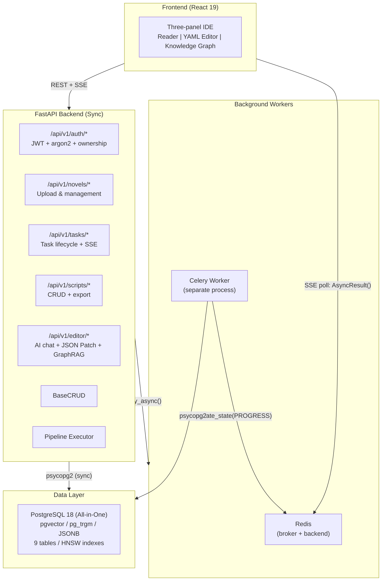
```mermaid
graph TD
    subgraph Frontend["Frontend (React 19)"]
        IDE["Three-panel IDE<br/>Reader | YAML Editor | Knowledge Graph"]
    end

    subgraph Backend["FastAPI Backend (Sync)"]
        Auth["/api/v1/auth/*<br/>JWT + argon2 + ownership"]
        Novels["/api/v1/novels/*<br/>Upload & management"]
        Tasks["/api/v1/tasks/*<br/>Task lifecycle + SSE"]
        Scripts["/api/v1/scripts/*<br/>CRUD + export"]
        Editor["/api/v1/editor/*<br/>AI chat + JSON Patch + GraphRAG"]
        BaseCRUD["BaseCRUD"]
        PipelineExec["Pipeline Executor"]
    end

    subgraph Worker["Background Workers"]
        Redis["Redis<br/>(broker + backend)"]
        CeleryW["Celery Worker<br/>(separate process)"]
    end

    subgraph DB["Data Layer"]
        PG["PostgreSQL 18 (All-in-One)<br/>pgvector / pg_trgm / JSONB<br/>9 tables / HNSW indexes"]
    end

    Frontend -->|"REST + SSE"| Backend
    Backend -->|"psycopg2 (sync)"| DB
    Backend -->|"apply_async()"| Worker
    CeleryW -->|"update_state(PROGRESS)"| Redis
    CeleryW -->|"psycopg2"| DB
    Frontend -->|"SSE poll: AsyncResult()"| Redis
```

**Key changes from 2.0.0:**

- Celery + Redis replaces in-process daemon threads for pipeline execution
- SSE polls `AsyncResult` from Redis instead of in-process `queue.Queue`
- Auth middleware (`get_current_user`) + `require_ownership` helpers on all write endpoints
- Query-time GraphRAG enriches editor chat with KG entity context
- Incremental KG building for novels with 5+ chapters
- Chapter embeddings + KG cached to DB for reuse across pipeline runs
- Paragraph-level splitting with model-aware context budgets

**Key changes from 2.1.0 (Redis auth services):**

- **Real logout**: `POST /logout` blacklists the JWT's `jti` in Redis (TTL = remaining lifetime)
- **Rate limiting**: `POST /login` limited to 5 attempts per email + IP per 15-minute window (429 on exceed)
- **User profile cache**: `get_current_user` checks Redis cache before DB; 5-minute TTL
- **Redis connection pool**: `core/redis.py` — lazy singleton, thread-safe init, `get_redis()` FastAPI dependency
- **Graceful degradation**: All Redis services catch `ConnectionError` — blacklist returns `False` (allow), rate limiter bypasses, cache falls through to DB

---

## 2. Data Models

### 2.1 Entity Relationship Diagram

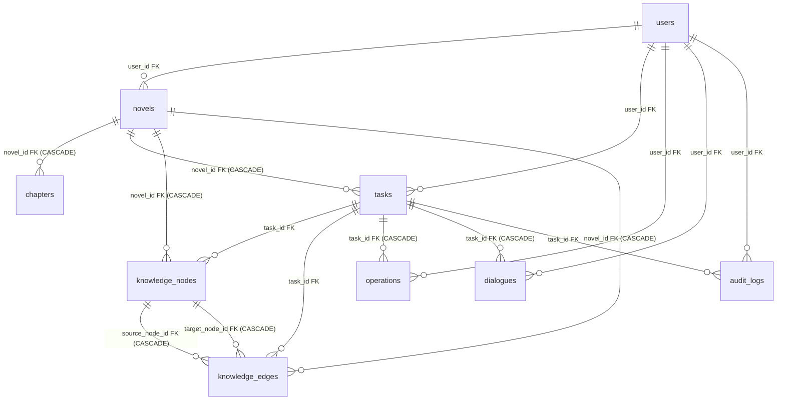
```mermaid
erDiagram
    users ||--o{ novels : "user_id FK"
    users ||--o{ tasks : "user_id FK"
    users ||--o{ operations : "user_id FK"
    users ||--o{ dialogues : "user_id FK"
    users ||--o{ audit_logs : "user_id FK"
    novels ||--o{ chapters : "novel_id FK (CASCADE)"
    novels ||--o{ tasks : "novel_id FK (CASCADE)"
    novels ||--o{ knowledge_nodes : "novel_id FK (CASCADE)"
    novels ||--o{ knowledge_edges : "novel_id FK (CASCADE)"
    tasks ||--o{ knowledge_nodes : "task_id FK"
    tasks ||--o{ knowledge_edges : "task_id FK"
    tasks ||--o{ operations : "task_id FK (CASCADE)"
    tasks ||--o{ dialogues : "task_id FK (CASCADE)"
    tasks ||--o{ audit_logs : "task_id FK"
    knowledge_nodes ||--o{ knowledge_edges : "source_node_id FK (CASCADE)"
    knowledge_nodes ||--o{ knowledge_edges : "target_node_id FK (CASCADE)"
```

### 2.2 users

| Column | Type | Default | Constraints |
|--------|------|---------|-------------|
| `id` | UUID (PK) | `uuid4()` | |
| `username` | VARCHAR(150) | | UNIQUE |
| `email` | VARCHAR(320) | | UNIQUE |
| `password_hash` | VARCHAR(255) | | |
| `display_name` | VARCHAR(200) | NULL | |
| `avatar_url` | TEXT | NULL | |
| `role` | VARCHAR(10) | `'user'` | CHECK IN ('admin','user') |
| `is_active` | BOOLEAN | `true` | |
| `last_login_at` | TIMESTAMPTZ | NULL | |
| `created_at` | TIMESTAMPTZ | `now()` | |
| `updated_at` | TIMESTAMPTZ | `now()` | |

### 2.3 novels

| Column | Type | Default | Constraints |
|--------|------|---------|-------------|
| `id` | UUID (PK) | `uuid4()` | |
| `user_id` | UUID (FK→users.id) | NULL | ON DELETE SET NULL |
| `title` | VARCHAR(500) | | NOT NULL |
| `author` | VARCHAR(300) | NULL | |
| `source_text` | TEXT | NULL | Full raw novel text |
| `word_count` | INTEGER | 0 | |
| `language` | VARCHAR(5) | `'zh'` | CHECK IN ('zh','en') |
| `status` | VARCHAR(20) | `'draft'` | CHECK IN ('draft','processing','completed') |
| `metadata` | JSONB | `'{}'` | |
| `created_at` | TIMESTAMPTZ | `now()` | |
| `updated_at` | TIMESTAMPTZ | `now()` | |

### 2.4 tasks

| Column | Type | Default | Constraints |
|--------|------|---------|-------------|
| `id` | UUID (PK) | `uuid4()` | |
| `novel_id` | UUID (FK→novels.id) | | NOT NULL, ON DELETE CASCADE |
| `user_id` | UUID (FK→users.id) | NULL | ON DELETE SET NULL |
| `status` | VARCHAR(30) | `'pending'` | CHECK IN ('pending','preprocessing','converting','completed','failed') |
| `progress` | INTEGER | 0 | CHECK 0–100 |
| `summary` | TEXT | NULL | One-paragraph script summary |
| `characters_json` | JSONB | `'[]'` | Array of character objects |
| `script_yaml` | TEXT | NULL | Full script in YAML format |
| `script_json` | JSONB | NULL | Full script as nested dict |
| `script_fountain` | TEXT | NULL | Fountain format (future) |
| `error_message` | TEXT | NULL | Pipeline failure details |
| `pipeline_config` | JSONB | `'{}'` | Configuration overrides |
| `created_at` | TIMESTAMPTZ | `now()` | |
| `updated_at` | TIMESTAMPTZ | `now()` | |

### 2.5 chapters

| Column | Type | Default | Constraints |
|--------|------|---------|-------------|
| `id` | UUID (PK) | `uuid4()` | |
| `novel_id` | UUID (FK→novels.id) | | NOT NULL, ON DELETE CASCADE |
| `chapter_index` | INTEGER | | NOT NULL |
| `title` | VARCHAR(500) | NULL | |
| `content` | TEXT | NULL | Chapter body text |
| `embedding` | VECTOR(1536) | NULL | pgvector HNSW index |
| `metadata` | JSONB | `'{}'` | |
| `created_at` | TIMESTAMPTZ | `now()` | |

Unique index: `uq_chapters_novel_index` ON `(novel_id, chapter_index)`.

### 2.6 knowledge_nodes

| Column | Type | Default | Constraints |
|--------|------|---------|-------------|
| `id` | UUID (PK) | `uuid4()` | |
| `novel_id` | UUID (FK→novels.id) | | NOT NULL, ON DELETE CASCADE |
| `task_id` | UUID (FK→tasks.id) | NULL | ON DELETE SET NULL |
| `node_type` | VARCHAR(20) | | CHECK IN ('character','location','item','organization','event','concept') |
| `name` | VARCHAR(300) | | NOT NULL |
| `aliases` | TEXT[] | `'{}'` | |
| `description` | TEXT | NULL | |
| `properties` | JSONB | `'{}'` | Extensible metadata |
| `embedding` | VECTOR(1536) | NULL | pgvector HNSW index |
| `created_at` | TIMESTAMPTZ | `now()` | |
| `updated_at` | TIMESTAMPTZ | `now()` | |

pg_trgm GIN index on `name` for fuzzy search.

### 2.7 knowledge_edges

| Column | Type | Default | Constraints |
|--------|------|---------|-------------|
| `id` | UUID (PK) | `uuid4()` | |
| `novel_id` | UUID (FK→novels.id) | | NOT NULL, ON DELETE CASCADE |
| `task_id` | UUID (FK→tasks.id) | NULL | ON DELETE SET NULL |
| `source_node_id` | UUID (FK→knowledge_nodes.id) | | ON DELETE CASCADE |
| `target_node_id` | UUID (FK→knowledge_nodes.id) | | ON DELETE CASCADE |
| `relation` | VARCHAR(100) | `''` | e.g. 'friend_of', 'located_in' |
| `weight` | FLOAT | 1.0 | Confidence 0.0–1.0 |
| `evidence` | TEXT | NULL | Source text citation |
| `metadata` | JSONB | `'{}'` | |
| `created_at` | TIMESTAMPTZ | `now()` | |

### 2.8 operations

| Column | Type | Default | Constraints |
|--------|------|---------|-------------|
| `id` | UUID (PK) | `uuid4()` | |
| `task_id` | UUID (FK→tasks.id) | | ON DELETE CASCADE |
| `user_id` | UUID (FK→users.id) | NULL | ON DELETE SET NULL |
| `type` | VARCHAR(20) | | CHECK IN ('manual_edit','ai_patch','snapshot','rollback') |
| `target_path` | TEXT | NULL | JSON Pointer path |
| `diff_json` | JSONB | `'{}'` | The applied change |
| `previous_snapshot` | JSONB | NULL | Value before change (for undo) |
| `applied` | BOOLEAN | `true` | Whether this op is currently active |
| `created_at` | TIMESTAMPTZ | `now()` | |

### 2.9 dialogues

| Column | Type | Default | Constraints |
|--------|------|---------|-------------|
| `id` | UUID (PK) | `uuid4()` | |
| `task_id` | UUID (FK→tasks.id) | | ON DELETE CASCADE |
| `user_id` | UUID (FK→users.id) | NULL | ON DELETE SET NULL |
| `role` | VARCHAR(10) | | CHECK IN ('user','assistant','system') |
| `content` | TEXT | `''` | Chat message body |
| `patch_json` | JSONB | `'{}'` | JSON Patch extracted from message |
| `metadata` | JSONB | `'{}'` | Context metadata |
| `created_at` | TIMESTAMPTZ | `now()` | |

### 2.10 audit_logs

| Column | Type | Default | Constraints |
|--------|------|---------|-------------|
| `id` | UUID (PK) | `uuid4()` | |
| `user_id` | UUID (FK→users.id) | NULL | ON DELETE SET NULL |
| `task_id` | UUID (FK→tasks.id) | NULL | ON DELETE SET NULL |
| `level` | VARCHAR(10) | `'info'` | CHECK IN ('debug','info','warn','error','fatal') |
| `category` | VARCHAR(100) | NULL | e.g. 'task_status' |
| `message` | TEXT | `''` | Human-readable description |
| `detail` | JSONB | `'{}'` | Structured data (from→to states) |
| `created_at` | TIMESTAMPTZ | `now()` | |

---

## 3. API Reference

All responses use `BaseResponse(code, message, data)` wrapper unless noted.

### 3.1 Auth — `/api/v1/auth`

#### POST /register

```
Request:  { username: str, email: str, password: str }
Response: { user_id: UUID, username: str }
Errors:   409 (duplicate email/username)
```

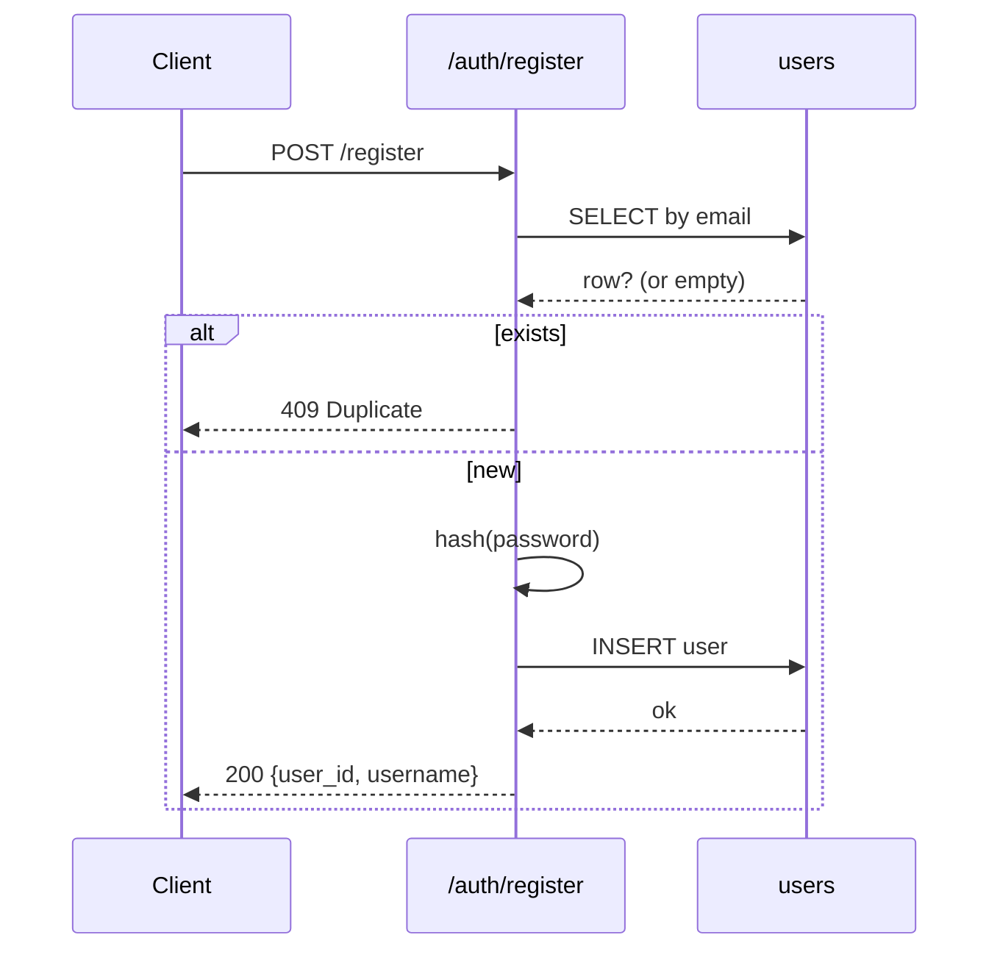
```mermaid
sequenceDiagram
    participant C as Client
    participant R as /auth/register
    participant U as users

    C->>R: POST /register
    R->>U: SELECT by email
    U-->>R: row? (or empty)
    alt exists
        R-->>C: 409 Duplicate
    else new
        R->>R: hash(password)
        R->>U: INSERT user
        U-->>R: ok
        R-->>C: 200 {user_id, username}
    end
```

#### POST /login

```
Request:  { email: str, password: str }
Response: { token: JWT, user: { id, username, role } }
Errors:   401
```

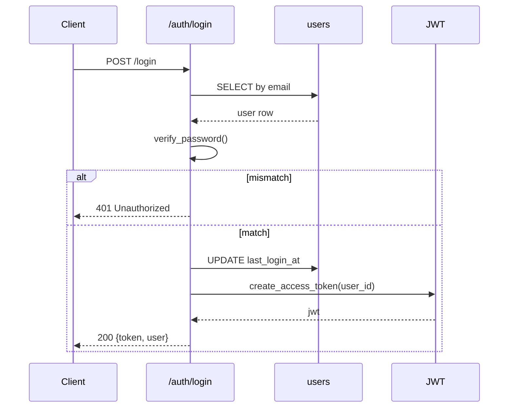
```mermaid
sequenceDiagram
    participant C as Client
    participant L as /auth/login
    participant U as users
    participant J as JWT

    C->>L: POST /login
    L->>U: SELECT by email
    U-->>L: user row
    L->>L: verify_password()
    alt mismatch
        L-->>C: 401 Unauthorized
    else match
        L->>U: UPDATE last_login_at
        L->>J: create_access_token(user_id)
        J-->>L: jwt
        L-->>C: 200 {token, user}
    end
```

#### GET /me

```
Headers:  Authorization: Bearer <jwt>
Response: { id, username, email, role }
Errors:   401
```

#### POST /logout

```
Headers:  Authorization: Bearer <jwt> (optional)
Response: { message: "已登出" }
Note:     Adds the JWT's jti to a Redis blacklist with TTL = remaining
          token lifetime.  The blacklist is checked in get_current_user
          before every authenticated request.  Without a token the
          endpoint is a no-op (backward-compatible 200).
```

### 3.1.1 Rate Limiting

Login is rate-limited via Redis INCR + EXPIRE (fixed-window).  Five failed
attempts per email + per IP within a 15-minute window return 429.  Successful
authentication clears both counters.

When Redis is unreachable rate limiting is bypassed (availability over strictness)
and a warning is logged.

### 3.2 Novels — `/api/v1/novels`

#### POST /upload

```
Request:  { content: str (≤5MB), title?: str, author?: str }
Response: { novel_id: UUID, title: str, chapters: [{index, title}] }
Errors:   400 (empty), 413 (too large)
```

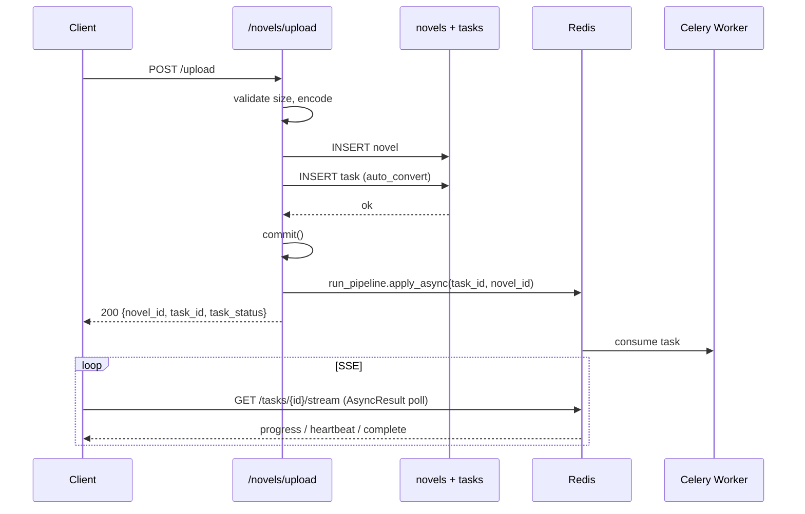
```mermaid
sequenceDiagram
    participant C as Client
    participant U as /novels/upload
    participant D as novels + tasks
    participant R as Redis
    participant W as Celery Worker

    C->>U: POST /upload
    U->>U: validate size, encode
    U->>D: INSERT novel
    U->>D: INSERT task (auto_convert)
    D-->>U: ok
    U->>U: commit()
    U->>R: run_pipeline.apply_async(task_id, novel_id)
    U-->>C: 200 {novel_id, task_id, task_status}
    R->>W: consume task
    loop SSE
        C->>R: GET /tasks/{id}/stream (AsyncResult poll)
        R-->>C: progress / heartbeat / complete
    end
```
Chapters are deferred to the Celery worker — the upload response returns
immediately with ``task_id`` (no blocking LLM call).

#### POST /upload/file

```
Multipart: file (text/plain), title (form), author (form?)
Same flow as /upload after reading file.
```

#### GET /

```
Query:    page: int=1, limit: int=20
Response: { total, items: [novel] }
```

#### GET /{novel_id}

```
Response: { novel, chapters: [chapter] }
Errors:   404, 422 (invalid UUID)
```

#### PUT /{novel_id}

```
Request:  { title?: str, author?: str }
Response: { novel }
Errors:   400 (nothing to update), 404, 422
```

#### DELETE /{novel_id}

```
Response: { deleted_id: UUID }
Errors:   404, 422
Flow:     DELETE chapters WHERE novel_id → DELETE novel
```

### 3.3 Tasks — `/api/v1/tasks`

#### POST /

```
Request:  { novel_id: str (UUID), pipeline_config?: dict }
Response: { task_id: UUID, status: "pending" }
Errors:   400 (invalid UUID), 404 (novel not found)
Side effect: Dispatches Celery task via Redis broker
```

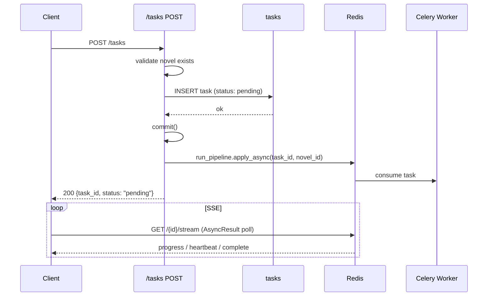
```mermaid
sequenceDiagram
    participant C as Client
    participant T as /tasks POST
    participant D as tasks
    participant R as Redis
    participant W as Celery Worker

    C->>T: POST /tasks
    T->>T: validate novel exists
    T->>D: INSERT task (status: pending)
    D-->>T: ok
    T->>T: commit()
    T->>R: run_pipeline.apply_async(task_id, novel_id)
    R->>W: consume task
    T-->>C: 200 {task_id, status: "pending"}
    loop SSE
        C->>R: GET /{id}/stream (AsyncResult poll)
        R-->>C: progress / heartbeat / complete
    end
```

#### GET /

```
Query:    novel_id?: UUID, status?: str, page: int=1, limit: int=20
Response: { tasks: [{id, novel_id, status, progress, summary, error_message, created_at, updated_at}], total, page, limit }
```

#### GET /{task_id}/stream (SSE)

```
Response: text/event-stream
Events:   progress { progress: int, stage: str }
          complete { progress: 100 }
          error    { error: str }
          heartbeat (empty, every 0.5s)
Errors:   400, 404
Mechanism: Polls Celery ``AsyncResult(task_id).state/.info`` from Redis
```

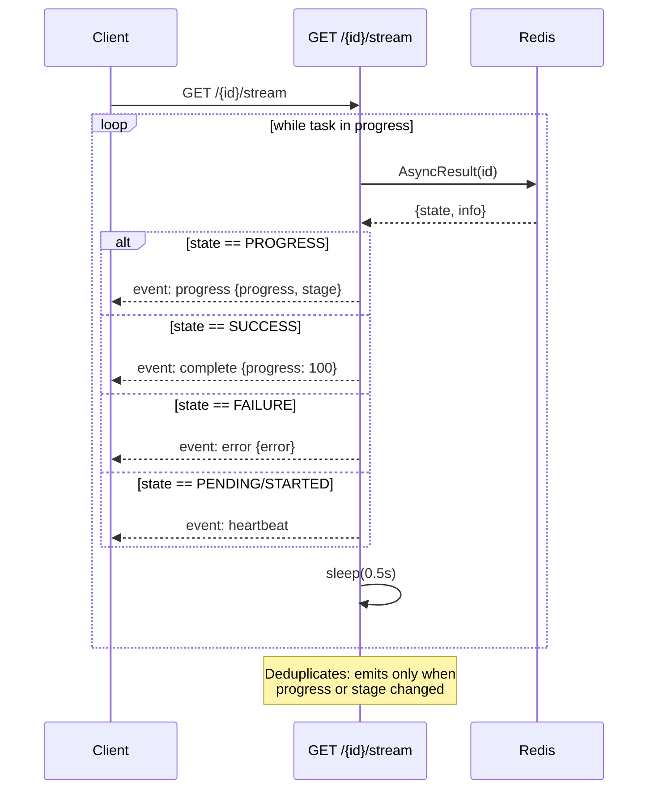
```mermaid
sequenceDiagram
    participant C as Client
    participant S as GET /{id}/stream
    participant R as Redis

    C->>S: GET /{id}/stream
    loop while task in progress
        S->>R: AsyncResult(id)
        R-->>S: {state, info}
        alt state == PROGRESS
            S-->>C: event: progress {progress, stage}
        else state == SUCCESS
            S-->>C: event: complete {progress: 100}
        else state == FAILURE
            S-->>C: event: error {error}
        else state == PENDING/STARTED
            S-->>C: event: heartbeat
        end
        S->>S: sleep(0.5s)
    end
    Note over S: Deduplicates: emits only when<br/>progress or stage changed
```

#### GET /{task_id}/status

```
Response: { task_id, status, progress, error_message }
Note:     Lightweight — no script artifacts.
```

#### PUT /{task_id}/status

```
Request:  { status: str, progress?: int (0–100), error_message?: str }
Response: { task_id, status, progress, error_message }
Errors:   400, 404, 422 (invalid transition)
Side effect: Writes AuditLog on status change
```

#### POST /{task_id}/resume

```
Response: { task_id, status: "converting" }
Errors:   400, 404, 422 (task not in "failed")
Side effect: Re-dispatches Celery pipeline task
```

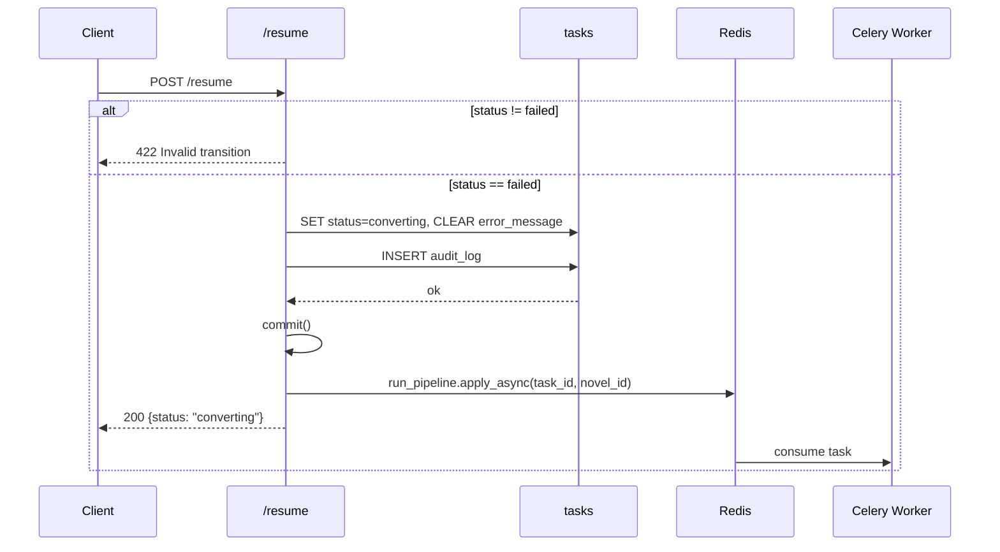
```mermaid
sequenceDiagram
    participant C as Client
    participant R as /resume
    participant T as tasks
    participant Redis
    participant W as Celery Worker

    C->>R: POST /resume
    alt status != failed
        R-->>C: 422 Invalid transition
    else status == failed
        R->>T: SET status=converting, CLEAR error_message
        R->>T: INSERT audit_log
        T-->>R: ok
        R->>R: commit()
        R->>Redis: run_pipeline.apply_async(task_id, novel_id)
        R-->>C: 200 {status: "converting"}
        Redis->>W: consume task
    end
```

#### GET /{task_id}

```
Response: Full task detail including all script artifacts
Note:     Must be registered LAST after /stream, /status
```

### 3.4 Scripts — `/api/v1/scripts`

> Scripts are stored in the `tasks` table. `script_id` maps to `Task.id`.

#### GET /

```
Query:    novel_id?: UUID, status?: str, page: int=1, limit: int=20
Response: { items: [{script_id, novel_id, status, progress, summary, scene_count, created_at, updated_at}], total, page, limit }
```

#### GET /{script_id}

```
Response: { script_id, novel_id, status, progress, summary, script_yaml, script_json, script_fountain, characters_json, created_at, updated_at }
Errors:   404, 422
```

#### PUT /{script_id}

```
Request:  { script_yaml: str }
Response: { script_id, updated_at, validation: { valid: bool, errors: str? } }
Errors:   404, 422 (invalid YAML)
Side effect: Creates Operation row (type="manual_edit", target_path="/script_yaml")
```

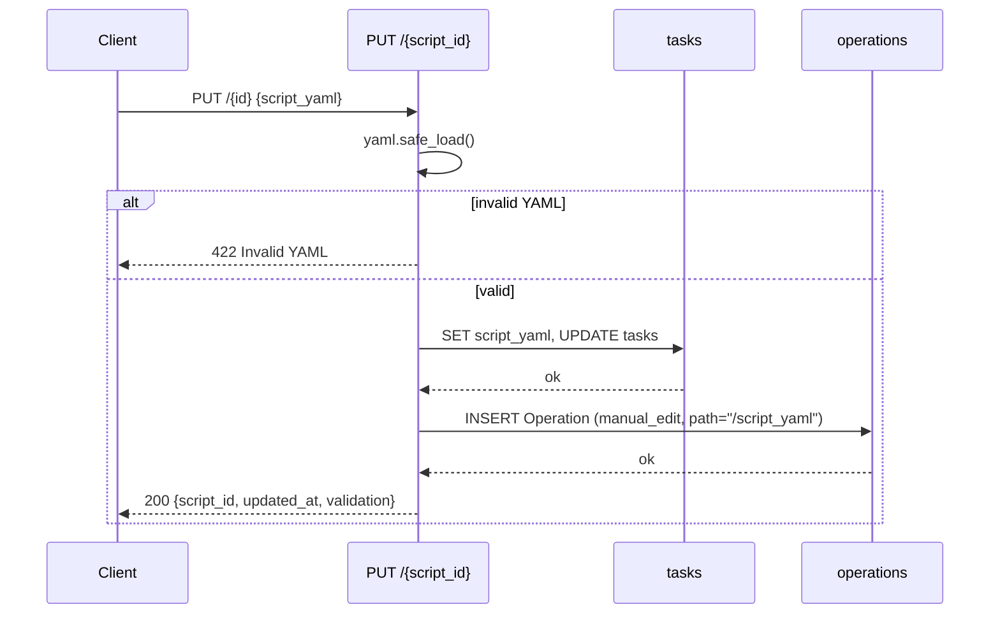
```mermaid
sequenceDiagram
    participant C as Client
    participant S as PUT /{script_id}
    participant T as tasks
    participant O as operations

    C->>S: PUT /{id} {script_yaml}
    S->>S: yaml.safe_load()
    alt invalid YAML
        S-->>C: 422 Invalid YAML
    else valid
        S->>T: SET script_yaml, UPDATE tasks
        T-->>S: ok
        S->>O: INSERT Operation (manual_edit, path="/script_yaml")
        O-->>S: ok
        S-->>C: 200 {script_id, updated_at, validation}
    end
```

#### DELETE /{script_id}

```
Response: { script_id }
Note:     Deletes the Task row (cascades to operations, dialogues, audit_logs)
```

#### GET /{script_id}/export

```
Query:    format: "yaml"|"json"|"fountain" (default: yaml)
Response: PlainTextResponse with raw content
Errors:   404, 422
```

### 3.5 Editor — `/api/v1/editor`

#### POST /chat/{task_id}

```
Request:  { message: str (min_length=1), scene_id?: str }
Response: { reply: str, patch: dict? }
Errors:   400, 404, 503 (LLM unavailable)
Note:     Queries knowledge_nodes/edges for entity mentions in message
          and injects 1-hop neighbour context into the system prompt
          (query-time GraphRAG).
```

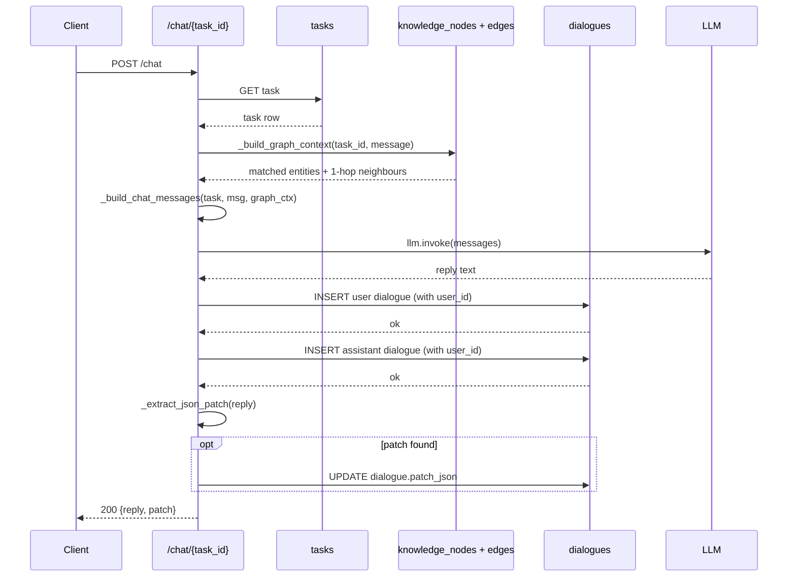
```mermaid
sequenceDiagram
    participant C as Client
    participant E as /chat/{task_id}
    participant T as tasks
    participant KG as knowledge_nodes + edges
    participant D as dialogues
    participant L as LLM

    C->>E: POST /chat
    E->>T: GET task
    T-->>E: task row
    E->>KG: _build_graph_context(task_id, message)
    KG-->>E: matched entities + 1-hop neighbours
    E->>E: _build_chat_messages(task, msg, graph_ctx)
    E->>L: llm.invoke(messages)
    L-->>E: reply text
    E->>D: INSERT user dialogue (with user_id)
    D-->>E: ok
    E->>D: INSERT assistant dialogue (with user_id)
    D-->>E: ok
    E->>E: _extract_json_patch(reply)
    opt patch found
        E->>D: UPDATE dialogue.patch_json
    end
    E-->>C: 200 {reply, patch}
```

#### POST /apply_patch/{task_id}

```
Request:  { op: "add"|"replace"|"remove", path: str, value: any }
Response: { script_json, operation_id: UUID }
Errors:   400, 404
```

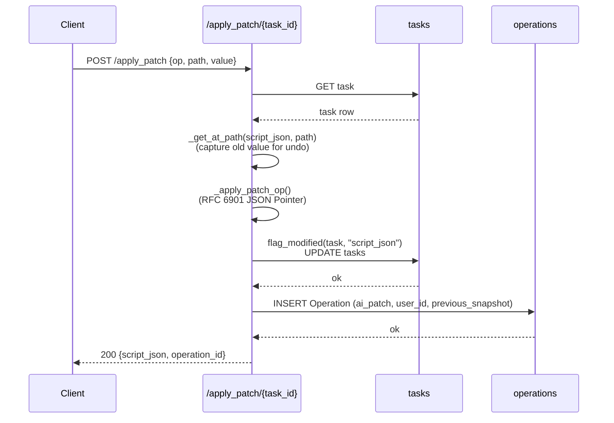
```mermaid
sequenceDiagram
    participant C as Client
    participant A as /apply_patch/{task_id}
    participant T as tasks
    participant O as operations

    C->>A: POST /apply_patch {op, path, value}
    A->>T: GET task
    T-->>A: task row
    A->>A: _get_at_path(script_json, path)<br/>(capture old value for undo)
    A->>A: _apply_patch_op()<br/>(RFC 6901 JSON Pointer)
    A->>T: flag_modified(task, "script_json")<br/>UPDATE tasks
    T-->>A: ok
    A->>O: INSERT Operation (ai_patch, user_id, previous_snapshot)
    O-->>A: ok
    A-->>C: 200 {script_json, operation_id}
```

#### POST /undo/{task_id}

```
Response: { script_json, undone_operation_id, rollback_operation_id }
Errors:   400 (nothing to undo), 404
```

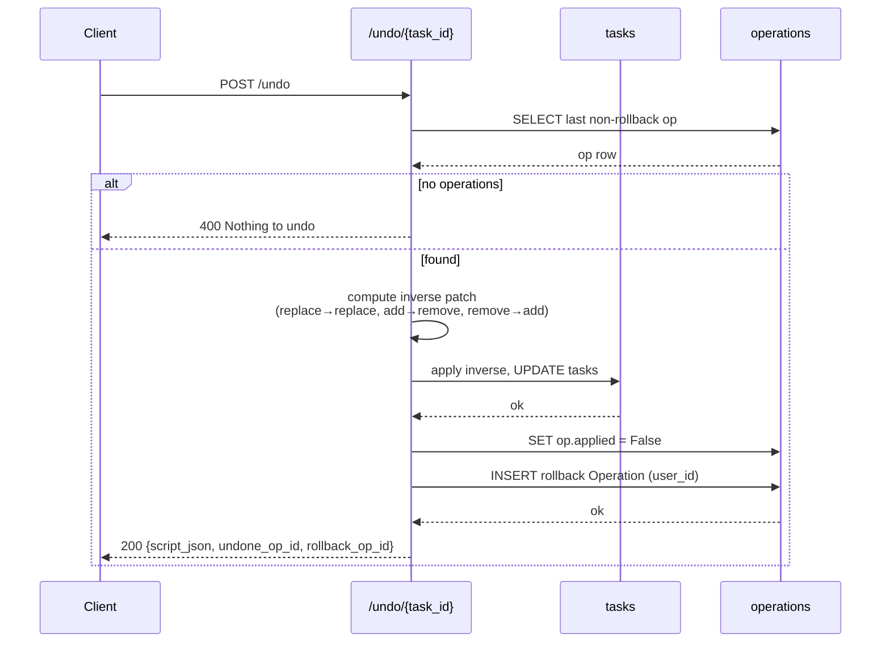
```mermaid
sequenceDiagram
    participant C as Client
    participant U as /undo/{task_id}
    participant T as tasks
    participant O as operations

    C->>U: POST /undo
    U->>O: SELECT last non-rollback op
    O-->>U: op row
    alt no operations
        U-->>C: 400 Nothing to undo
    else found
        U->>U: compute inverse patch<br/>(replace→replace, add→remove, remove→add)
        U->>T: apply inverse, UPDATE tasks
        T-->>U: ok
        U->>O: SET op.applied = False
        U->>O: INSERT rollback Operation (user_id)
        O-->>U: ok
        U-->>C: 200 {script_json, undone_op_id, rollback_op_id}
    end
```

---

## 4. Pipeline Engine

### 4.1 Stage Sequence

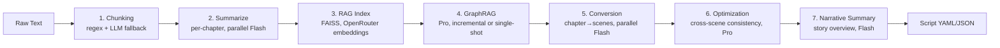
```mermaid
flowchart LR
    A[Raw Text] --> B[1. Chunking<br/>regex + LLM fallback]
    B --> C[2. Summarize<br/>per-chapter, parallel Flash]
    C --> D[3. RAG Index<br/>FAISS, OpenRouter embeddings]
    D --> E[4. GraphRAG<br/>Pro, incremental or single-shot]
    E --> F[5. Conversion<br/>chapter→scenes, parallel Flash]
    F --> G[6. Optimization<br/>cross-scene consistency, Pro]
    G --> H[7. Narrative Summary<br/>story overview, Flash]
    H --> I[Script YAML/JSON]
```


```mermaid
flowchart LR
    A["0% starting"] --> B["5% chunking"]
    B --> C["15% summarizing"]
    C --> D["25% rag"]
    D --> E["35% graphrag"]
    E --> F["35-75% converting"]
    F --> G["90% optimizing"]
    G --> H["100% assembling"]
```

| Stage | Model | Function | Progress |
|-------|-------|----------|----------|
| 0. Loading | — | `Path.read_text()` or DB chapters | 0% |
| 1. Chunking | Regex + DeepSeek Flash (fallback) | `split_chapters()` regex → LLM | 5% |
| 2. Summarize | DeepSeek Flash (async parallel) | `summarize_chapter()` 100-200 chars | 15% |
| 3. RAG Index | OpenRouter `text-embedding-3-small` | `build_index()` FAISS (or cached) | 25% |
| 4. GraphRAG | DeepSeek Pro (single-shot ≤5ch, incremental >5ch) | `extract_graph()` / `extract_graph_incremental()` | 35% |
| 5. Conversion | DeepSeek Flash (async parallel, with chapter summary) | `convert_chapter()` paragraph-group input | 35–75% |
| 6. Optimization | DeepSeek Pro (batched by scene) | `optimize()` cross-scene + source_ref restore | 90% |
| 7. Narrative Summary | DeepSeek Flash | `_narrative_summary()` from chapter summaries | — |
| — Assembly | — | Build `Script` model | 100% |

### 4.2 Data Flow

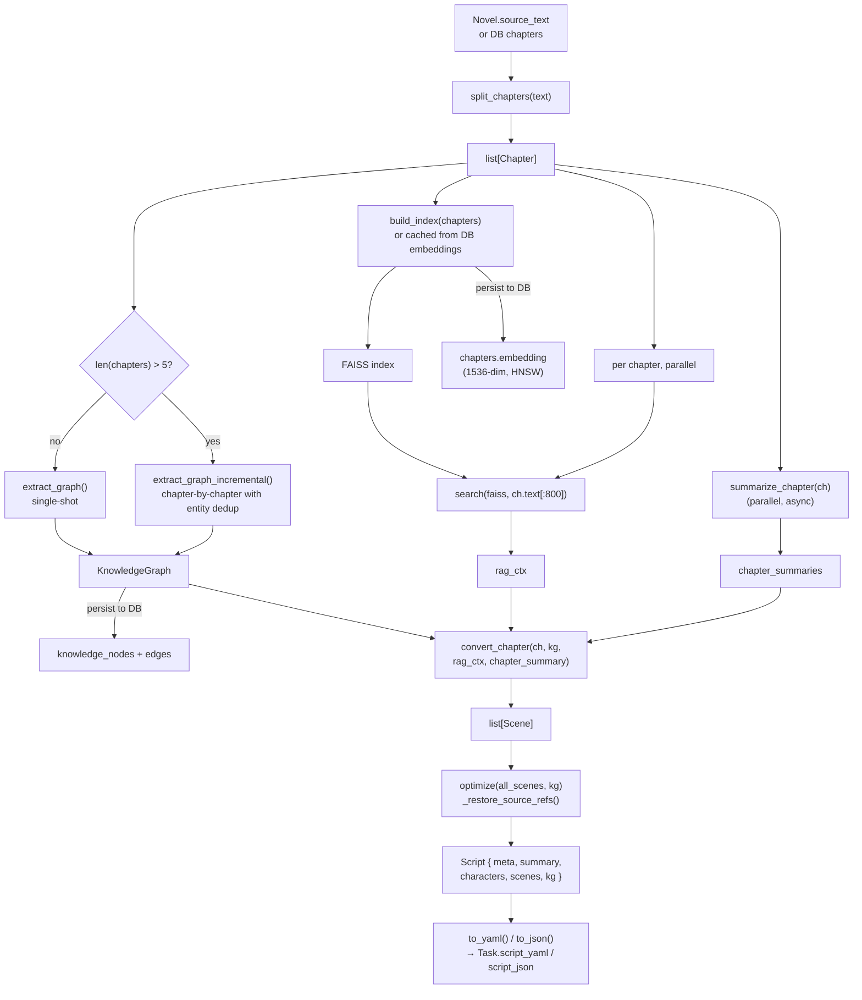
```mermaid
flowchart TD
    A["Novel.source_text<br/>or DB chapters"] --> B["split_chapters(text)"]
    B --> C["list[Chapter]"]
    C --> D["summarize_chapter(ch)<br/>(parallel, async)"]
    D --> E["chapter_summaries"]
    C --> F["build_index(chapters)<br/>or cached from DB embeddings"]
    F --> G["FAISS index"]
    C --> H{"len(chapters) > 5?"}
    H -->|yes| I["extract_graph_incremental()<br/>chapter-by-chapter with entity dedup"]
    H -->|no| J["extract_graph()<br/>single-shot"]
    I --> K["KnowledgeGraph"]
    J --> K
    K -->|"persist to DB"| KGDB["knowledge_nodes + edges"]
    F -->|"persist to DB"| VDB["chapters.embedding<br/>(1536-dim, HNSW)"]
    C --> PERCH["per chapter, parallel"]
    PERCH --> SRCH["search(faiss, ch.text[:800])"]
    SRCH --> RAG["rag_ctx"]
    G --> SRCH
    E --> CONV["convert_chapter(ch, kg,<br/>rag_ctx, chapter_summary)"]
    RAG --> CONV
    K --> CONV
    CONV --> SCENES["list[Scene]"]
    SCENES --> OPT["optimize(all_scenes, kg)<br/>_restore_source_refs()"]
    OPT --> SCR["Script { meta, summary,<br/>characters, scenes, kg }"]
    SCR --> EXP["to_yaml() / to_json()<br/>→ Task.script_yaml / script_json"]
```

### 4.3 Graceful Degradation

| Stage | Failure behavior |
|-------|-----------------|
| Chunking (LLM) | Falls back to single-chapter wrapping |
| GraphRAG | Returns empty `KnowledgeGraph()` |
| RAG Index | Returns `None` → keyword fallback on chapter texts |
| Conversion | Returns `[]` for that chapter (others continue) |
| Optimization | Returns original unoptimized scenes |
| Assembly | Always succeeds |

### 4.4 Model Routing

| Pipeline Stage | LLM Model | Purpose |
|---------------|-----------|---------|
| `chapter_split` | `deepseek-v4-flash` | Regex fallback chapter detection |
| `chapter_summary` | `deepseek-v4-flash` | Per-chapter objective summary (100-200 chars) |
| `global_extraction` | `deepseek-v4-pro` | Knowledge graph extraction (single-shot + incremental) |
| `scene_conversion` | `deepseek-v4-flash` | Per-chapter scene generation (with chapter summary) |
| `consistency_check` | `deepseek-v4-pro` | Cross-scene optimization (batched) |
| `ai_chat` | `deepseek-v4-flash` | Editor AI chat assistant (GraphRAG-enhanced) |

---

## 5. State Machines

### 5.1 Task Status State Machine

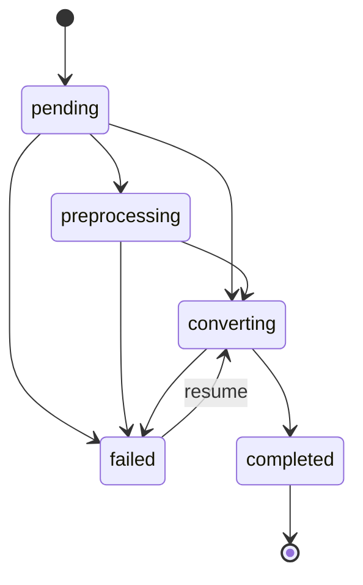
```mermaid
stateDiagram-v2
    [*] --> pending
    pending --> preprocessing
    pending --> converting
    pending --> failed
    preprocessing --> converting
    preprocessing --> failed
    converting --> completed
    converting --> failed
    failed --> converting: resume
    completed --> [*]
```

**Valid transitions:**
```
pending       → preprocessing | converting | failed
preprocessing → converting | failed
converting    → completed | failed
failed        → converting
```

**Transition triggers:**
- `pending → preprocessing`: Pipeline starts, chunking/graphrag/rag stages
- `preprocessing → converting`: Pipeline enters scene conversion stage
- `converting → completed`: Pipeline finishes successfully
- Any → `failed`: Exception during execution or `PUT /status`
- `failed → converting`: `POST /resume` (re-spawns pipeline)

### 5.2 Novel Status

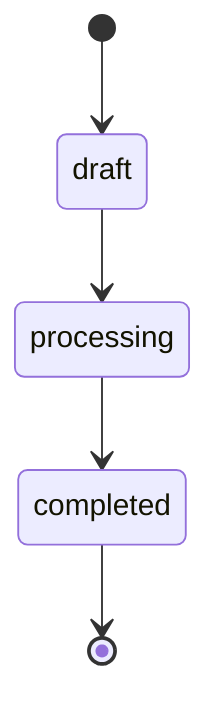
```mermaid
stateDiagram-v2
    [*] --> draft
    draft --> processing
    processing --> completed
    completed --> [*]
```

Set by the application, not automatically transitioned.

### 5.3 Operation Lifecycle

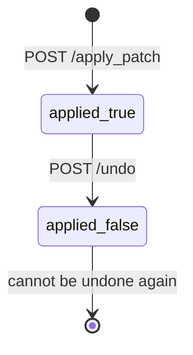
```mermaid
stateDiagram-v2
    [*] --> applied_true: POST /apply_patch
    applied_true --> applied_false: POST /undo
    applied_false --> [*]: cannot be undone again
```

---

## 6. Service Layer

### 6.1 BaseCRUD[T]

Generic synchronous repository for all 8 tables.

```
create(db, obj)        → obj          (add, flush, refresh)
get(db, pk)            → obj | None   (session.get)
list(db, offset, limit, filters, order_by) → (rows, total)
update(db, pk, dict)   → obj | None   (set attrs, auto updated_at)
delete(db, pk)         → bool         (get, delete, flush)
```

### 6.2 Celery Pipeline Worker

With the Celery migration, the pipeline runs in a **separate worker process**
dispatched via ``run_pipeline.apply_async(args=..., task_id=...)``.
Progress is reported through ``self.update_state(state='PROGRESS', meta=...)``,
which writes to Redis.  The SSE endpoint reads it back via
``AsyncResult(task_id).state/.info`` — **no in-process queue, no DB writes
for incremental progress ticks**.

### 6.3 DB Cache Helpers

The ``pipeline_executor`` module now provides **stateless DB helpers** for the
Celery worker:

- ``_load_chapters(session, novel_id)`` → (chapters, embeddings_map)
- ``_load_cached_kg(session, novel_id)`` → KnowledgeGraph or None
- ``_persist_kg(session, script, task_id, novel_id)`` → nodes/edges to DB
- ``_persist_embeddings(session, novel_id, ...)`` → 1536-dim vectors to DB
- ``_persist_chapters(session, novel_id, ...)`` → regex-split chapters to DB
- ``recover_stale_tasks()`` → marks orphaned tasks as failed on startup

These are called from the Celery task (``app.tasks.pipeline``), not from
the FastAPI request path.

---

## 7. SSE Progress Streaming

### 7.1 Event Protocol

All events use the SSE wire format:
```
event: <type>
data: <json>
```

| Event | Data | Stream behavior |
|-------|------|----------------|
| `progress` | `{"progress": 35, "stage": "converting"}` | Continues |
| `complete` | `{"progress": 100}` | Closes |
| `error` | `{"error": "Traceback ..."}` | Closes |
| `heartbeat` | `""` | Keeps alive (every 0.5s) |

### 7.2 Connection Lifecycle

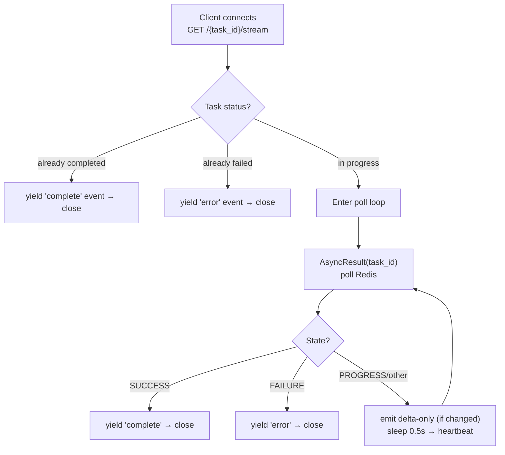
```mermaid
flowchart TD
    A["Client connects<br/>GET /{task_id}/stream"] --> B{"Task status?"}
    B -->|already completed| C["yield 'complete' event → close"]
    B -->|already failed| D["yield 'error' event → close"]
    B -->|in progress| E["Enter poll loop"]
    E --> F["AsyncResult(task_id)<br/>poll Redis"]
    F --> G{"State?"}
    G -->|SUCCESS| H["yield 'complete' → close"]
    G -->|FAILURE| I["yield 'error' → close"]
    G -->|PROGRESS/other| J["emit delta-only (if changed)<br/>sleep 0.5s → heartbeat"]
    J --> F
```

### 7.3 Progress Values

| Progress | Stage | DB Status | Celery State |
|----------|-------|-----------|-------------|
| 0% | starting | pending | STARTED |
| 5% | chunking | preprocessing | PROGRESS |
| 15% | summarizing | preprocessing | PROGRESS |
| 25% | rag | preprocessing | PROGRESS |
| 35% | graphrag | preprocessing | PROGRESS |
| 35–75% | converting | converting | PROGRESS |
| 90% | optimizing | converting | PROGRESS |
| 100% | assembling | completed | SUCCESS |

---

## Appendix: Complete Route Table

| Method | Path | Purpose | Auth |
|--------|------|---------|------|
| POST | `/api/v1/auth/register` | Create account | No |
| POST | `/api/v1/auth/login` | Login → JWT | No |
| POST | `/api/v1/auth/logout` | Logout (Redis jti blacklist) | No |
| GET | `/api/v1/auth/me` | Current user | Bearer |
| POST | `/api/v1/novels/upload` | Upload novel + auto-create Task + dispatch Celery | Bearer |
| POST | `/api/v1/novels/upload/file` | Upload novel file + auto-create Task | Bearer |
| GET | `/api/v1/novels/` | List novels | No |
| GET | `/api/v1/novels/{id}` | Get novel + chapters | No |
| PUT | `/api/v1/novels/{id}` | Update novel (ownership check) | Bearer |
| DELETE | `/api/v1/novels/{id}` | Delete novel + chapters (ownership check) | Bearer |
| POST | `/api/v1/tasks/` | Create task + dispatch Celery pipeline | Bearer |
| GET | `/api/v1/tasks/` | List tasks | No |
| GET | `/api/v1/tasks/{id}/stream` | SSE progress stream (polls Redis AsyncResult) | No |
| GET | `/api/v1/tasks/{id}/status` | Task status (lightweight) | No |
| PUT | `/api/v1/tasks/{id}/status` | Update task status (ownership check) | Bearer |
| POST | `/api/v1/tasks/{id}/resume` | Resume failed task (ownership check) | Bearer |
| GET | `/api/v1/tasks/{id}` | Full task detail | No |
| GET | `/api/v1/scripts/` | List scripts | No |
| GET | `/api/v1/scripts/{id}` | Get script detail | No |
| PUT | `/api/v1/scripts/{id}` | Edit script YAML + record Operation | Bearer |
| DELETE | `/api/v1/scripts/{id}` | Delete script (ownership check) | Bearer |
| GET | `/api/v1/scripts/{id}/export` | Export (yaml/json/fountain) | No |
| POST | `/api/v1/editor/chat/{id}` | AI chat + GraphRAG context + save dialogue | Bearer |
| POST | `/api/v1/editor/apply_patch/{id}` | Apply JSON Patch + record Operation | Bearer |
| POST | `/api/v1/editor/undo/{id}` | Undo last patch + rollback Operation | Bearer |
| GET | `/health` | Health check | No |
